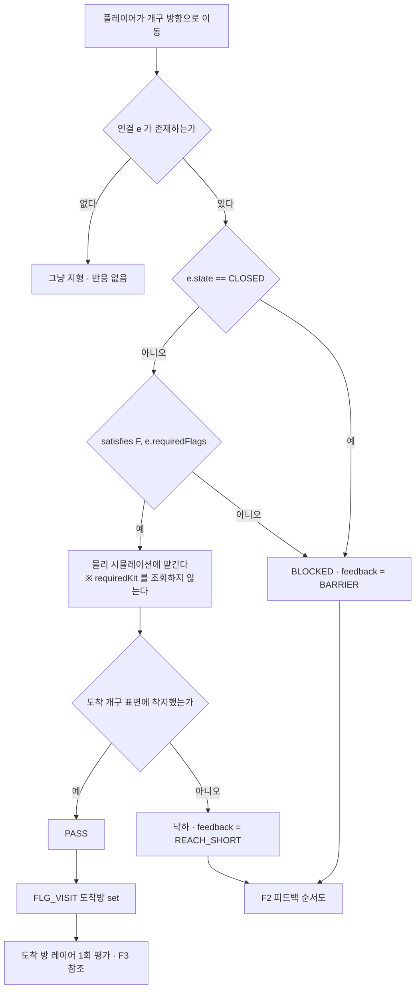
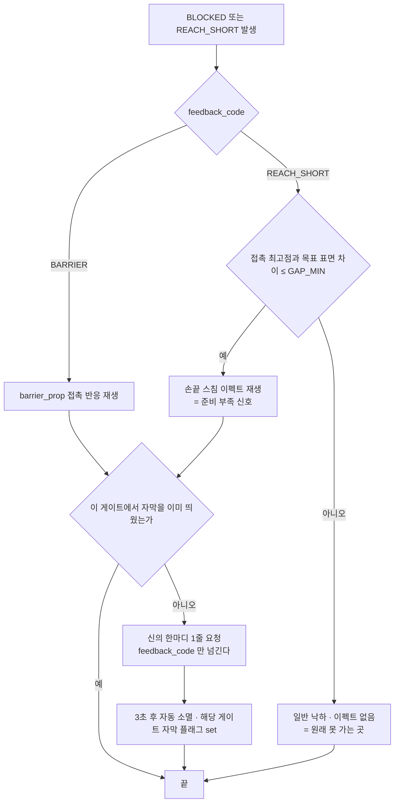
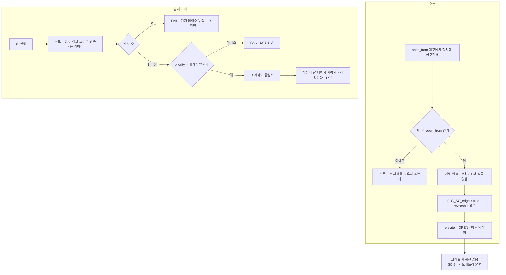
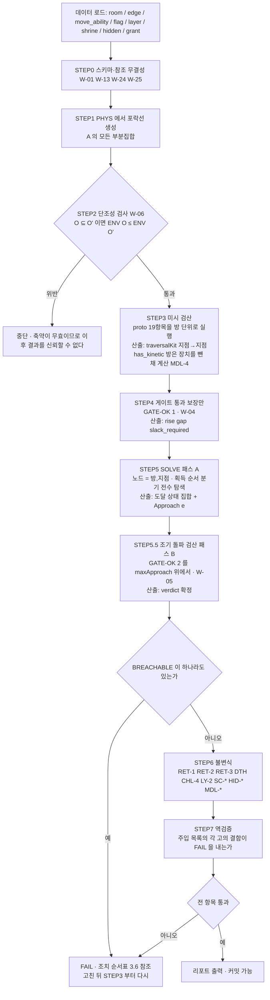

# 시스템 명세 원장 (systems.md)

> **역할** `[2026-08-09 문서 일원화]`: 시스템 명세는 **파일을 늘리지 않고 이 문서 하나에 장(章)으로 쌓는다.**
> 현재 1장뿐. 舊 경로 `specs/2026-08-09-world-graph-gating.md`에서 이동.
> ⚠ **컨셉·스토리·월드를 보러 왔다면 여기가 아니다** — `game-design.md` / `story-design.md` / `world-design.md`. 이 문서는 구현·검산용 명세다.

---

# 제1장 — 월드 그래프 · 게이팅 · 복귀

> ## 상태: **rev.2 — 2차 판정 `REVISE`(7건 잔여) · 오너 미승인 · 착수 중단**
> **2차 판정 요지**(`design-critic`): 1차 12건은 **전부 원문에서 반영 확인**(재탕 0건). 새 지적 7건 중 **[상] 2건은 기술 결함**(연결 방향성 · 플래그 단조성),
> **나머지 5건은 오너 판정과 얽혀 있다**(챌린지 룸 · PONR 사망 · 이동 플랫폼 · 누적 넉백). ⇒ **팀 규칙 §3「3회 규칙」의 정신에 따라 쟁점을 오너에게 올린 상태.**
> **advisor 재검증 완료** `[2026-08-09]`: 산출 수치 `GATE_MARGIN 0.3000` · `MEAS_EPS 0.1917` · `GAP_MIN 0.4917`을 `tuning.json`에서 직접 계산해 **소수점까지 일치** 확인. `proto` 무변경 · 검증 **19/19 PASS** 유지.
> 작성 = `system-designer` `[2026-08-09]` · 팀 합의 순서 B-2 ①(`TODO.md`) · 착수 조건 = A-8 5건(advisor 처리 완료).
> **이 문서는 아직 정본이 아니다.** 검토 → advisor 재검증 → 오너 승인 전까지 어떤 값도 확정으로 인용하지 말 것.
> **rev.2에서 무엇이 바뀌었는지는 §0(검토 대응 이력)에 전부 적었다.** 구조가 바뀐 절이 다섯이다(§3.3 · §3.6 · §3.10 · §3.14 · 표 8 신설).

**근거 문서** (이 문서가 전제로 삼는 것 — 충돌 시 아래가 우선한다)

| 문서 | 이 문서가 받는 것 |
|---|---|
| `docs/game-design.md` | §3.6 이동기 불가침·비용 모델 · §6.3 자원 · §7.5 전달 원칙 · §7.10 소프트 게이팅 · §9.2 방 예산 · §11-12·11-13 · §12 체크리스트 16조 |
| `story-design.md` 1부 | 막 = 신앙 4단계 · 하드 게이트 = 성물 3 · 세계 상태 변화 규칙(§4) · 되돌아올 수 없는 지점(§3-終) |
| `world-design.md` 1부 | 장소 목록·순서·방 배분 ≈120 **(A-7 판정 대기 — 이 문서는 그 표의 *구조*만 쓰고 *내용*은 안 쓴다)** |
| `docs/unity/tuning.json` | `PHYS` **불가침** · `GATE_MARGIN` |
| `proto/index.html` | `REACH` 유도식 · `ENV` 포락선 모델 · `GATE_MARGIN` · `MEAS_EPS` · 검증 19항목 |
| `docs/game-design-theory.md` | 기획서 7단계(§5) · 기획 의도(§6) · 대량 생산 구조(§4.1) |
| `docs/agent-team.md` §7 | 이 문서의 범위를 정한 3라운드 논의 결과 |

**표기 규약**

- `[확정]` = 상위 문서에서 이미 오너가 확정한 것의 인용 / `[가안]` = 이 문서의 제안(뒤집어도 됨) / `[미정]` = 빈칸 — **누가·언제·무엇을 기준으로**를 반드시 동반한다(§9).
- **고유명·지명은 전부 ID로 쓴다** (§11-6 작명 미판정 · A-7 장소 판정 대기). 사람이 읽을 이름은 별도 작명 테이블이 나중에 채운다.
- **수치를 손으로 적지 않는다.** 모든 도달·여유 값은 `PHYS`에서 유도하고, 문서에 나타나는 숫자는 전부 「도구가 계산한 산출값」으로 표시한다.

**이 문서의 범위 밖** (팀 합의 — 여기서 결정하지 않는다)

성물·이동기 **배분** · 신규 이동기의 **형태와 수치** · **지도 화면** 전체 설계 · 퀘스트 레코드 본체 · 전투/적/아이템/경제 수치 · 패스트트래블 · **proto 맵 지오메트리 수정(C-1)**.

---

# 0. 검토 대응 이력 (rev.1 → rev.2)

`design-critic` 판정 **REVISE · 12건**. **수용 11 · 부분 반박 1**. 무엇을 어떻게 고쳤는지 여기 전부 적는다 — 지적을 조용히 지나가지 않는다.

| # | 지적 | 등급 | 처리 | 어디를 고쳤나 |
|---|---|---|---|---|
| 1 | **모델 밖 변위**(넉백·적 밟기·가호 변위·이동 플랫폼)가 검산에 없다 | 상 | **수용** | §3.15 신설(MDL-1~5) · §3.7 정리에 **P5** 추가 · W-21~W-23 신설 · §10-6 |
| 2 | `Reach()`의 `나갈 개구`가 미결속 — 노드가 방 단위라 (진입→퇴출) 쌍을 표현 못 함 | 상 | **수용** | §3.14 전면 재작성 — **노드 = (방, 개구)** |
| 3 | `grants`의 획득 조건 테이블이 없다 — SOLVE가 첫 줄에서 멈춘다 | 상 | **수용** | **표 8 `grant` 신설** · §3.14가 그것을 참조 |
| 4 | 평행 간선 ↔ 조기 돌파 검산이 동시 성립 불가 | 상 | **수용** | §3.3 — **평행 간선 폐지**, 「여러 방법」을 `required_kit` **안티체인**으로 흡수 |
| 5 | `A` 기준 (2)가 소수 kit 게이트를 산술적으로 불가능하게 만든다 | 상 | **수용** | §3.6 **GATE-OK 재정의** — 정량자 범위를 `A`에서 **접근 가능 kit `Approach(e)`** 로. 순환 의존은 §3.6-C **최소 반례 정리**로 1패스에 닫았다 |
| 6 | `required_kit`이 「보유 선언」과 「포락선 입력」 두 뜻으로 쓰인다 | 상 | **수용** | §3.3 KIT-3 — **포락선에 그대로 들어가는 완전 kit**로 일원화. 예시값에 `MV_RUN` 복원 |
| 7 | 사망·부활 워프가 모델에 없다 | 중 | **수용 + 부분 반박** | §3.2에 `DEATH` 전이 명시 · §3.8 DTH-1~3. **RET를 「걷기만」으로 정의하는 것은 유지**(근거 §3.8 주석) · §10-3 비용표 정정 |
| 8 | `parentKit`/`hidKit`이 단일 집합인데 `minKits()`는 집합의 집합을 준다 | 중 | **수용** | §3.10 — **안티체인 상향폐포 비교**로 재정의. 정상 데이터가 `ERROR`로 떨어지지 않는다 |
| 9 | MOV-1이 오너 확정 문장(후딜레이)을 접지 한정으로 **좁혔다** | 중 | **수용** | §3.7 MOV-1에 **축소 고지** 명시 · §10-7로 오너 판정 요청 승격 |
| 10 | §3.12 비용·편익 표가 틀렸다(하드 게이트 개수는 이미 고정이 아니다) | 중 | **수용** | §3.12 이득 문구 재작성 · §1 「양보 불가」 문구 정정 · §10-1 대가 열 재작성 |
| 11 | SC-6(구역마다 숏컷 1개)이 신계·재넘이·여울 나루에서 성립하지 않는다 | 중 | **수용** | §3.9 **SC-6 개정**(면제 조건을 데이터로 판정) · §9-15 `SC_MIN_ROOMS` |
| 12 | G3 「손해가 된다」가 LY-2와 어긋난다 | 하 | **수용** | §1 G3 문구를 **「손해로 만들 수단이 있다」**로 정정 — 부록 B와 일치 |

**부분 반박은 7번 하나뿐이다.** 상세 근거는 §3.8 「부활 전이를 RET에 넣지 않는 이유」.

---

# 1. 기획 의도 — 왜 이 시스템을 먼저 만드는가

> ## **이 게임의 벽은 「캐릭터가 약해서」가 아니라 「그 몸이 아직 거기까지 못 가서」여야 한다.**
> ## 그리고 그 판정을 사람의 눈이 아니라 **데이터가 하게 만들어야 한다.**

**WHY — 이 시스템이 없으면 무엇이 죽는가**

1. **메트로베니아의 정체성이 여기 걸려 있다.** 「능력으로 세계가 열린다」는 이 장르의 정의이고(§12-3·§12-8), 그 열림/닫힘을 정하는 규칙이 곧 게임의 뼈대다. 전투·스킬·퀘스트는 전부 이 뼈대 위에 얹히지, 그 반대가 아니다. **장르 원칙**(탐험이 중심, 전투는 요소 중 하나)을 시스템 층에서 지키는 장치가 이것 하나다.
2. **1인 2년 스코프에서 손 검산이 불가능하다.** 방 ≈120 · 게이트 수십 개 · 이동기 조합 2ⁿ. 사람이 한 번 훑는 데 며칠 걸리고, 지오메트리를 한 칸 옮길 때마다 처음부터 다시다. **검산이 자동이 아니면 이 게임은 완성되지 않는다.** 이 문서의 절반이 검산 규칙인 이유다.
3. **이 프로젝트에서 이미 세 번 사고가 났다.** ①이동기에 마나가 붙으면 영구 소프트락이 성립한다(§11-12) ②적이 스케일링하지 않으면 최후반 몰아치기가 항상 최적이 되어 상태 변화 레이어링이 통째로 사장된다(§11-13) ③*"덤으로 함께 닫힌다"*고 계상한 항목이 실측하니 **19/19를 18/19로 깨뜨렸다**. 셋 다 **"규칙으로 금지"해서 막은 게 아니라 "구조로 불가능"하게 만들어야** 재발하지 않는다.
4. **대량 생산 구조가 곧 스코프 방어다**(이론 §4.1). 방·연결·게이트가 **데이터 행**이 되면 새 지역은 스크립트가 아니라 표를 늘리는 일이 된다. 게이트 하나가 방 30개보다 싸다(§9.2)는 원칙은, 게이트를 **싸게 만들 수 있을 때만** 참이다.

**PURPOSE — 이 시스템이 보장해야 하는 것 (합격 조건)**

| # | 보장 | 어떻게 |
|---|---|---|
| **G1** | **소프트락이 원리적으로 불가능하다** | 이동기가 자원을 안 쓴다(오너 확정) + 사당은 접지 위에만 + 복귀 불변식 검사 → §3.7 정리 |
| **G2** | **조기 돌파가 불가능하다** | 요구 도달을 kit 집합으로 선언하고, **그 게이트에 실제로 닿을 수 있는 kit 전수 탐색**으로 반증한다 → §3.6 |
| **G3** | **최후반 몰아치기를 손해로 만들 수단이 있다** ★ | 방 레이어에 **막 진행도 창**을 두어, 지나간 막의 레이어를 다시 볼 수 없게 **표현 가능**하게 한다 → §3.11 |
| **G4** | **길을 대신 걸어주지 않는다** | 게이트는 *"지금은 안 된다"*만 말하고 **무엇이 필요한지 절대 말하지 않는다**(§7.5) → §4 |
| **G5** | **검산 하네스 자체가 틀렸을 때 잡힌다** | 모든 검산 항목에 **역검증**(무엇을 망가뜨리면 FAIL이 나야 하는가)을 붙인다 → §7 |

> ⚠ **G3의 문구는 rev.2에서 약해졌다 — 정직하게 적는다.** rev.1은 *"손해가 된다"*라고 썼지만, LY-2가 창 밖 레이어에서 **획득물을 빼내므로**(missable 금지) 몰아치기로 잃는 것은 대사·연출·NPC 배치뿐이고 **이익(원석·성물·화력·완주)은 하나도 줄지 않는다.** 즉 이 문서가 닫은 것은 **수단**이지 **동기**가 아니다. 몰아치기를 실제로 손해로 만들려면 전투·보상 층의 설계(적 배치·보상 곡선)가 필요하고 그것은 이 문서의 범위 밖이다 ⇒ §9-7·부록 B와 문구를 일치시켰다.

**★ 무엇을 지키고 무엇을 양보할 것인가** (이론 §6.3)

- **양보 불가**: G1~G5 · `PHYS` 불가침 · **「도달을 막는 하드 게이트」는 이동기(성물)뿐**(§7.10) · 「정보는 주고 길은 안 준다」.
- **양보 가능**: ID 이름 · 테이블 컬럼명 · 검산 도구의 구현 언어와 실행 시점 · 챌린지 룸 경계 규칙의 강도(오너 판정 대기 — §10).

> ⚠ **「하드 게이트는 이동기뿐」의 정확한 사정거리** `[rev.2 정정]`. 이 문서는 축 2(`requiredFlags` + `barrier_prop`)로 **개수 제한 없는 하드 게이트**를 열어 두었다(§3.3). 그러므로 *"하드 게이트 총수 = 이동기 수로 고정"*은 **이 문서 안에서 이미 참이 아니다.**
> §7.10이 실제로 지키는 것은 **「도달(traversal)의 하드 게이트는 이동기뿐」**이다. 진행 플래그 게이트가 §7.10을 안 깨는 이유는 개수가 아니라 **단조성**이다 — `gating` 플래그는 `revocable = false`(FLAG-1)이고 `FLG_ACT`는 단조 증가(FLAG-3)라서, **플래그 게이트는 계속 진행하면 반드시 열린다.** 반면 도달과 계열은 되돌릴 수 있거나 한 번에 하나뿐이라 소프트락을 만든다.
> 이 정정은 §3.12의 비용·편익 표(§10-1)에 직접 영향을 준다 — 거기서도 고쳤다.

---

# 2. 용어와 ID 규약

## 2.1 용어

| 용어 | 정의 (이 문서 안에서 이 뜻으로만 쓴다) |
|---|---|
| **방 (room)** | 화면 단위 공간 하나. 월드 그래프의 노드. `RM_*` |
| **개구 (port)** | 방의 경계에 있는 출입 지점. 한 방에 0개 이상. `PT_*` |
| **지점 (spot)** | 방 **안**의 관심 위치 — 사당·grant·은닉물·`hazard_respawn`. `SPOT_*` `[rev.2 신설]` |
| **노드 (node)** | **`(방, 개구 또는 지점)` 쌍.** 월드 그래프의 정점. `[rev.2 — 방 단위에서 바뀌었다]` §3.14-A |
| **연결 (edge)** | 두 개구를 잇는 통행 관계. 게이트 조건이 붙는 곳은 **오직 여기**뿐이다. 같은 개구 쌍에 연결은 **최대 1개**(§3.3). `ED_*` |
| **이동기 (movement ability)** | 도달을 바꾸는 상시 능력. `MV_*`. §3.6 확정 — 계열 무관·항상 켜짐·조합 가능 |
| **kit** | 플레이어가 **현재 보유한 이동기의 집합**. 예: `{MV_RUN, MV_JUMP, MV_DASH}` |
| **A (전체 kit)** | 게임 안에 존재하는 모든 이동기의 집합. `kit ⊆ A` |
| **포락선 (envelope)** | kit 하나에 대해 `PHYS`만으로 유도한 「높이차 dy → 최대 수평거리 dx」 표. proto `ENV`와 동일 모델 |
| **게이트 (gate)** | `requiredKit ≠ []` 이거나 `requiredFlags ≠ []` 인 연결 |
| **`covers(O, K)`** | kit `O`가 안티체인 `K`의 **어느 한 집합을 통째로** 포함하는가 — 통행 판정의 유일한 kit 술어(§3.3) |
| **`Approach(e)`** | 연결 `e`의 요구를 못 갖춘 채 `e` 앞에 설 수 있는 kit들. **조기 돌파 검산의 정량자 범위**(§3.6-B) |
| **사당 (shrine)** | 세이브·부활 지점. `SHR_*`. **충전 기능 없음** — 마나·정수병 충전은 신전 허브뿐(§7.7 · A-8 ③) |
| **허브 (hub)** | 신전 거점 노드 `RM_TEMPLE_HUB`. 복귀 불변식의 목표점 |
| **막 진행도 (act)** | 정수. 序=0 · 1~4막 = 1~4 · 終=5. 플래그 `FLG_ACT` 하나로 표현 |
| **레이어 (layer)** | 같은 방에 얹히는 콘텐츠 한 벌(NPC 배치·대사 세트·연출). `LY_*` |
| **계열 (lineage)** | 발현 = 불/서리/벼락. `LIN_FIRE` / `LIN_FROST` / `LIN_BOLT`. **통행 판정에 절대 들어가지 않는다** |
| **미시 검산** | 방 **안**의 표면 그래프 검사. proto 19항목을 방 단위로 재사용한다 |
| **거시 검산** | 방 **사이**의 월드 그래프 검사. 이 문서가 신설하는 25항목(§7) |

## 2.2 ID 규약

```
RM_<zone>_<nn>        방          예: RM_ZN_A_07
PT_<room>_<dir>       개구        예: PT_RM_ZN_A_07_E        (dir ∈ N/S/E/W/U/D)
ED_<portA>__<portB>   연결        예: ED_PT_RM_ZN_A_07_E__PT_RM_ZN_A_08_W
MV_<name>             이동기      예: MV_DASH
FLG_<cat>_<name>      플래그      예: FLG_SC_ED_...          (cat = ACT/VISIT/DONE/CHOICE/SC)
LY_<room>_<nn>        방 레이어   예: LY_RM_ZN_A_07_02
SHR_<zone>_<nn>       사당        예: SHR_ZN_A_01
HID_<room>_<nn>       은닉물      예: HID_RM_ZN_A_07_01
LIN_FIRE|FROST|BOLT   계열
ZN_<code>             구역(지역)  예: ZN_A
```

**구역 ID 배정** `[가안 — A-7 승인 후 확정]`: 지명이 미판정이므로 **구조적 역할로만** 부른다.

| ID | 역할 (world-route 대응) | 비고 |
|---|---|---|
| `ZN_HUB` | 신전 거점 | 허브 |
| `ZN_GODS` | 신계 | 거점 아님 |
| `ZN_A` / `ZN_B` / `ZN_C` | 종족 땅 3 | 진행 순서는 진행 골격 소관 |
| `ZN_P1` / `ZN_P2` / `ZN_P3` | 인간 마을(통로) 3 | 그중 하나가 독립 막 무대 |

> ⚠ **이 배정은 A-7(세계 동선 판정)의 결과를 기다린다.** 이 문서의 어떤 규칙도 어느 구역이 어느 종족인지에 의존하지 않는다 — 의존하면 A-7 판정 결과에 따라 시스템이 흔들리기 때문이다.

---

# 3. 동작 방식 — 입력 → 반응 → 결과

## 3.0 두 층으로 나눈다 (그리고 그 이유)

```
┌──────────────────────────────────────────────────────────────┐
│  거시 층 (월드 그래프)   방 ── 연결 ── 방                      │
│    · 노드 = 방            · 간선 = 연결(게이트 조건 3축)        │
│    · 여기서 SOLVE(진행 가능성)·복귀 불변식·조기 돌파를 검산      │
├──────────────────────────────────────────────────────────────┤
│  미시 층 (방 안 표면 그래프)   표면 ── 도약 ── 표면             │
│    · proto가 이미 하고 있는 것. 19항목 그대로 재사용            │
│    · 산출물 하나만 위로 올린다 → traversalKit[지점→지점]        │
└──────────────────────────────────────────────────────────────┘
```

- **왜 나누는가**: 방 하나의 내부 지오메트리는 이미 proto의 검증 하네스가 다룬다(DRY). 새로 만들 것은 **방 사이**의 규칙뿐이다.
- **두 층이 만나는 지점은 하나다**: 미시 검산이 「이 방 안에서 X에서 Y로 가려면 최소 어떤 kit가 필요한가」를 계산해 `room.traversalKit[X→Y]` 로 올린다(`X, Y ∈ 개구 ∪ 지점`). 거시 검산은 그 값만 쓴다.
  ⚠ `[rev.2]` **rev.1은 이 인터페이스를 개구 쌍으로 정의해 놓고 정작 거시 그래프의 노드를 「방」으로 두어, 「어느 개구로 들어와 어느 개구로 나가는가」를 표현할 수 없었다.** 노드를 `(방, 지점)`으로 바꿔 고쳤다 — §3.14-A.
- **W-03 정합 검사**가 두 층을 묶는다(§7). 방 안 발판 하나를 지우면 거시 검산이 FAIL 나야 한다 — 안 나면 두 층이 따로 놀고 있다는 뜻이다.

## 3.1 ★ 대전제 — `requiredKit`은 런타임 판정이 아니다

> ## **이동기 게이트는 코드가 막는 게 아니라 지형이 막는다.**

| | `requiredKit` (도달 축) | `requiredFlags` (진행 상태 축) |
|---|---|---|
| **런타임에 조회하는가** | **아니다.** 조회 코드가 존재하지 않는다 | **그렇다.** 배리어 오브젝트가 조회한다 |
| **무엇이 막는가** | **지오메트리**(간격·높이) | **물리 배리어**(격자·봉인 — §12-16) |
| **데이터의 역할** | **빌드 타임 검산용 선언** | 런타임 조건식 |
| **틀렸을 때** | 아무도 안 막으므로 **그냥 뚫린다** ⇒ §3.6 검산이 유일한 방어선 | 배리어가 안 열리거나 잘못 열린다 ⇒ 즉시 눈에 보인다 |

- **왜 이렇게 하는가**: 런타임에 `if(!kit.has(MV_X)) return;` 을 쓰는 순간 그 이동기는 **열쇠**가 된다 — §12-3(업그레이드는 열쇠가 아니라 플레이 방식의 변화) 위반이고, 「도달이 조합된다」는 §3.6 불가침 조항이 무의미해진다.
- **파생 규칙 KIT-1**: **`requiredKit`에 등재될 수 있는 이동기는 「도달을 바꾸는 것」뿐이다.** 「지형을 바꾸는 것」(부수기·태우기·얼리기)은 이 시스템의 kit가 아니다 — 그것들은 §3.12 챌린지 룸 경계 규칙의 관할이다. 파괴형 이동기를 도입하려면 오너 판정이 필요하다(§9-6).

## 3.2 연결 통과 판정 — 입력·반응·결과

**입력 (I)**

| | 입력 | 출처 |
|---|---|---|
| I1 | 이동 조작(좌우·점프·이동기 발동·상호작용) | 플레이어 |
| I2 | 현재 노드 `n` | 런타임 |
| I3 | 보유 kit `O ⊆ A` | 세이브 데이터 |
| I4 | 플래그 상태 `F` | 세이브 데이터 |
| I5 | 현재 가호 계열 `L` | 세이브 데이터 — **판정에 쓰이지 않는다** |

**판정식 (R)** — 이것이 전부다. 예외 절이 없다.

```
traverse(edge e, state (n, O, F)) :
    ① e.state == CLOSED            →  BLOCKED(SHORTCUT_CLOSED)
    ② ¬ satisfies(F, e.requiredFlags) →  BLOCKED(BARRIER)
    ③ 그 외                          →  PHYSICS      // 물리 시뮬레이션에 맡긴다
```

- `satisfies(F, R)` = R의 모든 절이 참. 절의 형식은 `flag == value` · `flag >= value` · `flag in {…}` 셋뿐(§6 표 4).
- **③에서 kit를 보지 않는다**(§3.1). 물리가 통과시키면 통과다.
- `L`(계열)은 어느 분기에도 나타나지 않는다. **이것이 「소프트 전용」의 정확한 의미다.**

**결과 (O)**

| 결과 | 다음에 일어나는 일 |
|---|---|
| `PASS` | 노드 이동 · `FLG_VISIT_<room>` set · 도착 방의 레이어 1회 평가(§3.11) |
| `BLOCKED(BARRIER)` | 배리어 충돌 + §4.2 피드백 `BARRIER` |
| `BLOCKED(SHORTCUT_CLOSED)` | 닫힌 숏컷 장치 충돌 + §4.2 피드백 `BARRIER` |
| `PHYSICS` → 도달 실패 | 낙하·미끄러짐 + §4.2 피드백 `REACH_SHORT` |

**★ 연결이 아닌 위치 전이 — 전량 목록** `[rev.2 신설 · 지적 7]`

rev.1은 `traverse()`만 적어 두고 **연결을 타지 않는 위치 이동**을 통째로 빠뜨렸다. 런타임에 실재하는데 모델에 없으면 검산이 그 경로를 영원히 못 본다. 위치를 바꾸는 것은 **아래 셋이 전부**이고, 이 목록에 없는 수단을 만들면 그것이 곧 §3.15 위반이다.

| 전이 | 형식 | 검산에서의 취급 |
|---|---|---|
| `EDGE` | `traverse(e, (n,O,F))` — 위 판정식 | SOLVE·RET가 쓰는 유일한 전이 |
| **`DEATH`** | `(n, O, F) → (lastShrine, O, F)` · `n ∉ PONR` | **모델에는 넣되 RET 검사에는 쓰지 않는다** — §3.8 DTH-1~3 |
| **`HAZARD_RESPAWN`** | `(n, O, F) → (n의 hazard_respawn, O, F)` | 같은 방 안이므로 노드가 안 바뀐다 — 그래프에 영향 없음(SHR-4) |

- **`DEATH`가 kit·플래그를 바꾸지 않는 것이 핵심이다.** 바꾸면 §3.7 정리가 무효가 된다(§6.8 「기술·재화 무손실」이 이를 보장한다).
- 「밟기·넉백·바람」류는 **위치 전이가 아니라 물리다.** 그것들은 §3.15가 관할하고, 그 결론은 **게이트 지오메트리에 관여하지 못하게 막는 것**이다.

## 3.3 게이트 조건식 — 3축

```
                     ┌───────────────────────────────────────────┐
   requiredKit  ───▶ │ 하드 · 도달의 문제 · 지오메트리가 판정      │  통행을 막는다
   requiredFlags ──▶ │ 하드 · 진행 상태의 문제 · 배리어가 판정     │  통행을 막는다
   lineageHint  ───▶ │ 소프트 · 발현 계열 · 어디에서도 판정 안 함  │  ★ 통행을 막지 않는다
                     └───────────────────────────────────────────┘
```

### 축 1 — `requiredKit` (하드 · 도달) `[rev.2 재정의 — 지적 4·6]`

- 타입: **`list<set<MV_*>>` — ⊆-안티체인**(어느 원소도 다른 원소의 부분집합이 아니다). 빈 목록 `[]` = 자유 통행.
- **의미**: 「이 연결을 넘는 방법은 이 목록이 전부다. 목록의 **어느 한 집합을 통째로** 갖고 있으면 넘고, 어느 것도 통째로 못 갖췄으면 못 넘는다」.
  ```
  covers(O, K) ≡ ∃ Kᵢ ∈ K :  Kᵢ ⊆ O            // 이 kit로 넘을 수 있는가
  ```
- **KIT-3 (해석의 여지 제거 — 지적 6)**: 목록의 각 `Kᵢ`는 **포락선 생성기에 그대로 입력되는 완전한 kit 집합**이다. 「추가로 필요한 것」이 아니라 「그것만 들고 있을 때의 몸」이다.
  ⇒ **시작 보유 이동기도 반드시 명시적으로 적는다.** 예시값이 `{MV_JUMP, MV_AIRJUMP}`가 아니라 **`{MV_RUN, MV_JUMP, MV_AIRJUMP}`** 인 이유다 — `MV_RUN`을 빼면 `envSlack`이 「제자리 점프만 하는 몸」의 포락선으로 계산돼 평범한 도약이 `UNREACHABLE`로 나온다.
  ⇒ 「보유 조건 선언」과 「포락선 입력」은 **같은 값**이다. 두 뜻이 갈리지 않는다.
- **★ 평행 간선은 폐지한다 (지적 4)**. 같은 개구 쌍에는 연결이 **최대 1개**다(검산 W-24).
  - **왜**: 산출 열이 `rise = 도착 개구 상단 − 출발 개구 상단` · `gap = 두 개구 사이 수평 간격`으로 **개구 좌표에서만** 유도되므로, 평행 간선 둘은 지오메트리가 **반드시 동일**하다. 그러면 서로가 서로의 조기 돌파 반례가 되어 **양쪽 다 100% `BREACHABLE`** 이 된다. rev.1이 「여러 경로」를 표현하라고 지정한 유일한 수단이 검산에서 항상 FAIL 나는 상태였다.
  - **대신 「여러 방법」은 두 층에서 표현한다**:

  | 상황 | 표현 수단 |
  |---|---|
  | **같은 지형을 여러 능력 조합으로 넘는다** (예: 「이단점프로도, 충전돌진으로도」) | **하나의 연결 · `required_kit` 안티체인에 두 집합** |
  | **물리적으로 다른 통로가 둘이다** (윗길·아랫길) | **개구를 나눈다** — 다른 개구 쌍 = 다른 연결. 개구 수는 방당 0..8로 여유가 있다(표 1) |

  ⇒ 부록 A 7조(연결된 세계 + 여러 경로)의 근거가 **평행 간선에서 이 두 수단으로 교체**됐다.
- **여전히 임의 OR은 없다.** 안티체인은 「양의 리터럴 논리곱들의 논리합」이라는 **정규형** 하나뿐이고, 이것이 상향폐포(monotone) 집합의 최소 생성자와 1:1이라 §3.6의 부분집합 검산이 그대로 정의된다(§3.6-B).

### 축 2 — `requiredFlags` (하드 · 진행 상태)

- 타입: `list<조건절>`. 빈 목록 = 조건 없음.
- **§12-16 강제**: `requiredFlags ≠ ∅` 인 연결은 **반드시 `barrier_prop`(물리 오브젝트 ID)을 가진다.** *"아직 갈 수 없습니다"* 같은 비물리 차단 금지. 검산 항목 W-17.
- 참조할 수 있는 플래그는 **`gating = true`로 등록된 것뿐이다**(§3.13). 아무 플래그나 게이트에 쓰면 SOLVE의 상태 공간이 폭발한다.

### 축 3 — `lineageHint` (소프트 · 발현 계열) ★ 통과를 막지 않는다

- 타입: `LIN_FIRE | LIN_FROST | LIN_BOLT | NONE`. 방(room)과 연결(edge) 양쪽에 붙일 수 있다.
- **불변식 LIN-1**: `lineageHint`는 **`traverse()`의 어느 분기에도 나타나지 않는다.** 코드 검색으로 검증 가능해야 한다(W-20 자매 항목).
- **그럼 무엇에 쓰는가** — 소비처는 정확히 셋뿐이다:
  1. **전투 난이도의 데이터 근거** — 그 구역 적의 약점 계열(§6.7). 「갈 수는 있는데 어렵다」(§7.10 소프트 게이트)를 만드는 것은 **적**이지 지형이 아니다.
  2. **게이트 피드백의 문구 선택**(§4.2) — 하드로 막힌 것인지 그냥 힘든 것인지를 구분해서 보여주기 위한 분기.
  3. **지도 데이터 계약**(§4.5) — **이미 방문한 방에 한해서만** 노출된다. 미방문 방에는 절대 노출되지 않으므로 마커로 기능할 수 없다.
- **왜 소프트 전용인가**: §7.10이 *"하드 게이트 = 이동기가 없다 / 개수 = 이동기 수로 고정"*으로 못 박았다. 계열을 하드로 쓰면 하드 게이트 수가 이동기 수를 넘고, 가호를 아직 못 받은 구간에서 **소프트락이 성립한다.**

## 3.4 ★ 요구 도달의 표기 — 수치가 아니라 kit 집합

> **연결에 `dy 2.9u 이상 필요` 라고 적으면, `PHYS`를 한 번 만지는 순간 그 줄이 전부 거짓말이 된다.**

**저작자가 쓰는 것** (표 2 `edge`):

| 컬럼 | 예 |
|---|---|
| `requiredKit` | `[ {MV_RUN, MV_JUMP, MV_AIRJUMP} ]` — 안티체인(§3.3). **시작 이동기까지 전부 적는다**(KIT-3) |
| `geometry_ref` | 그 연결이 실제로 놓인 지오메트리(개구 좌표) 참조 |

**도구가 채우는 것** (산출 열 — 손으로 쓰면 검산 FAIL):

| 산출 컬럼 | 유도식 |
|---|---|
| `rise` | `dy = 도착 개구 표면 상단 − 출발 개구 표면 상단` |
| `gap` | `dx = 두 개구 사이 수평 간격` (겹치면 0) |
| `slack_required[i]` | 각 `Kᵢ ∈ requiredKit`에 대해 `envSlack(Kᵢ, dx, dy)` — **전부 `≤ −GAP_MIN`이어야 한다** |
| `approach_max` | `Approach(e)`의 ⊆-극대 kit 목록 — **SOLVE 산출**(§3.6-C) |
| `slack_breach[O]` | 각 `O ∈ approach_max`에 대해 `envSlack(O, dx, dy)` — **전부 `≥ GAP_MIN`이어야 한다** |
| `verdict` | `OK` / `TOO_TIGHT` / `BREACHABLE` / `UNREACHABLE` |

> ⚠ **`slack_breach`의 기준 집합이 rev.1에서 바뀌었다.** rev.1은 `A∖{k}`(전체 kit에서 하나 뺀 것)를 봤고, 그것이 게이트를 산술적으로 만들 수 없게 만들었다 — 근거와 재현 계산은 §3.6-A에 있다.

- `envSlack`·`envDx`·`maxRise`·`buildEnvelope`의 정의는 **proto `index.html`의 함수 그대로**를 정본으로 쓴다(재작성 금지 — DRY). 본편 도구는 그 함수를 그대로 이식한다.
- ★ **경로 종류의 취급을 못 박는다** (proto에서 `canMove`와 `envSlack`이 갈리는 지점이라 반드시 명시해야 한다):

| 경로 | §3.6 (1) 통과 보장 | §3.6 (2) 조기 돌파 불가 |
|---|---|---|
| 단순 도약(포락선) | 포함 | 포함 |
| **벽점프 경유**(`wall_designated` 벽을 차고 오르기) | **포함** — 넘을 수 있으면 넘는 것이다 | **포함** — ★ 빠뜨리면 「벽 하나 때문에 게이트가 통째로 뚫리는」 사고가 난다 |
| 차폐(`occluded`) 판정 | 포함 | 포함 |

  ⇒ 두 검사 모두 **`canMove`와 동일한 경로 집합**을 본다. `envSlack`이 벽점프를 안 보는 proto의 현재 형태를 그대로 이식하면 (2)가 헐거워진다 — 이식 시 **`slackOf(a,b,kit)` 를 「`canMove`가 보는 모든 경로 중 최소 slack」으로 확장**한다. 역검증: 게이트 옆에 `wall_designated` 벽을 하나 붙이면 W-05가 FAIL 나야 한다.
- **KIT-2**: 어떤 문서·표·주석에도 「이 게이트는 N u 필요」라고 쓰지 않는다. 필요한 것은 kit 이름이고, 수치는 언제나 산출 열에서 읽는다.
- **A-3(창대 도약 vault 폐지) 판정에 흔들리지 않는 이유**: kit 원소를 하나 추가/삭제하는 작업은 **① `move_ability` 표 1행 ② 포락선 1개 ③ 재검산 실행**으로 끝난다. 판정식(§3.2)·검산 알고리즘(§3.6)·불변식(§3.8)은 **한 글자도 바뀌지 않는다.** 그래서 이 문서는 vault의 존폐를 전제하지 않는다.

## 3.5 게이트 여유 — `GAP_MIN`

**공식** (전부 유도값 — 손으로 적은 숫자 없음)

```
GATE_MARGIN = max(0.30, PHYS.ledgeSnap × 3.5)          ← proto 정의 그대로 (tuning.json)
MEAS_EPS    = ENV_STEP + vmax(A) × CTRL.dt             ← 이산화 오차 상한
              ENV_STEP = 포락선 버킷 크기 (검산 하네스 상수)
              vmax(A)  = 전체 kit A로 낼 수 있는 최대 수평속도
★ GAP_MIN   = GATE_MARGIN + MEAS_EPS
```

**왜 둘을 더하는가** — 이것이 `TODO.md` C-1이 지적한 구멍이다.

- `GATE_MARGIN`은 **런타임 관대함**(`ledgeSnap`)을 흡수하는 여유다.
- `MEAS_EPS`는 **검산 자체의 오차**다 — 포락선은 0.1u 버킷으로 이산화돼 있고, 컨트롤러는 한 스텝(`CTRL.dt`)마다만 상태를 갱신한다. 그래서 「모델이 못 간다고 판정한 곳」이 실제로는 최대 `MEAS_EPS`만큼 더 갈 수 있다.
- **둘을 더하지 않으면 실효 여유가 `GATE_MARGIN − MEAS_EPS`로 줄어든다.** proto는 지금 이 상태다(C-1).

**`vmax(A)`를 쓰는 이유**: 조기 돌파 검산은 여러 부분집합에 대해 돌아가고 부분집합마다 최대 속도가 다르다. 집합마다 다른 `GAP_MIN`을 쓰면 값이 흔들려 표가 읽히지 않는다 ⇒ **전체 kit의 최대 속도로 고정한 하나의 보수적 상수**를 쓴다.

> **산출 예시** — 아래 숫자는 **도구가 현재 `tuning.json`에서 계산한 값**이지 설계 수치가 아니다. `PHYS`가 바뀌면 자동으로 바뀐다.
>
> | 항목 | 산출값 |
> |---|---|
> | `GATE_MARGIN` | `0.300` |
> | `MEAS_EPS` (proto 인스턴스 — `vmax = dashSpeed`) | `0.165` |
> | `MEAS_EPS` (전체 kit — `vmax = sdashSpeed`) | `0.192` |
> | `GAP_MIN` (본편 규칙) | **`0.492`** |

⚠ **정직 고지 — 이 규칙을 지금 proto 맵에 적용하면 깨진다.** `GATE_MARGIN`을 `0.465`로 올렸을 때 razor 쌍이 5 → 16으로 늘고 검증이 **19/19 → 18/19 FAIL**이 된 실측 기록이 있다(`docs/agent-team.md` §7). `GAP_MIN ≈ 0.492`는 그보다 더 큰 값이다.
⇒ **`GAP_MIN`은 「본편 맵을 처음부터 그 여유로 만든다」는 제작 규칙이다.** proto 맵 지오메트리 수정은 이 문서의 범위 밖이며 **C-1로 남는다**(§9-4).

## 3.6 ★ 조기 돌파 검산 `[rev.2 전면 재정의 — 지적 5]`

> **런타임이 안 막으므로(§3.1), 「아직 못 가야 하는 곳에 갈 수 있는가」는 빌드 타임에 반증해야 한다.**

### 3.6-A 왜 rev.1의 정의를 버렸는가 — 산술로 확인한다

rev.1은 조기 돌파를 이렇게 적었다:

```
(2-구)  ∀ O ⊆ A 이면서 O ⊉ K :  envSlack(O, dx, dy) ≥ GAP_MIN
        ⟺  ∀ k ∈ K : envSlack(A∖{k}, dx, dy) ≥ GAP_MIN
```

`A`는 **게임 전체 이동기**이므로, 이 식은 *"게임 끝까지 얻게 될 능력들로도 넘을 수 없어야 한다"*를 요구한다. **뒤에 얻는 능력으로 넘는 것은 조기 돌파가 아니라 정상적인 백트래킹인데(§12-8), (2-구)는 그것까지 FAIL로 만든다.** 결과는 산술적 파탄이다 — 현행 `tuning.json`으로 재현한다(도구 산출, 손으로 적은 숫자 없음):

| 검사 | 요구 | 산출 |
|---|---|---|
| `K = {MV_RUN, MV_JUMP, MV_AIRJUMP}` · (1) | `rise ≤ REACH.doubleJump − GAP_MIN` | `≤ 2.394` |
| 같은 게이트 · (2-구) `k = MV_AIRJUMP` | `rise ≥ (REACH.jump + REACH.sdash) + GAP_MIN` | `≥ 3.734` |
| **해집합** | | **∅ — 이단점프 하나로 여는 게이트를 만들 수 없다** |
| `K = 4단 체인 전부` · (1)∧(2-구) | | `rise ∈ [3.734, 4.044]` — **폭 0.310u**뿐 |

⇒ (2-구)를 지키면 **모든 하드 게이트가 「최후반 이동기를 포함한 전 체인」을 요구**하게 되어, 진행 골격이 정한 성물 1(1막)·2(2막)·3(4막)이 **각각** 여는 게이트를 표현할 수 없다. 게이트를 만들라고 만든 규칙이 게이트를 못 만들게 했다.

### 3.6-B 새 정의 — 정량자의 범위를 「실제로 그 앞에 설 수 있는 kit」로 좁힌다

**조기 돌파의 정확한 뜻**: *"설계가 의도한 것보다 **이른 진행 단계**에서 이 연결을 넘는다."* 「능력을 덜 갖고」가 아니라 **「아직 그 능력을 얻기 전에」**다. 그러므로 반례를 찾을 곳은 `A`의 모든 부분집합이 아니라 **그 게이트 앞에 실제로 서 있을 수 있는 kit들**이다.

```
Approach(e) = { O :  ∃ 도달 가능 상태에서 플레이어가 e 의 출발 개구에 서 있고
                     그때의 kit 가 O 이며,  ¬covers(O, K) }          ← K = e.requiredKit
                     ※ 양방향 연결은 양쪽 개구 각각에 대해 구한다

GATE-OK(e) ≡
  (1) 통과 보장     :  ∀ Kᵢ ∈ K            :  envSlack(Kᵢ, dx, dy)  ≤  −GAP_MIN
  (2) 조기 돌파 불가 :  ∀ O ∈ Approach(e)  :  envSlack(O,  dx, dy)  ≥   GAP_MIN
```

- `envSlack`이 **음수 = 도달 가능**(여유가 남음), **양수 = 도달 불가**(그만큼 모자람) — proto 정의 그대로.
- (1)은 「선언한 방법들은 전부 실제로 넘는다」를, (2)는 「그 방법을 아직 못 갖춘 채 여기 온 몸으로는 못 넘는다」를 요구한다. **양면 검사는 유지된다** — proto가 창대쉬 게이트에서 배운 교훈은 그대로다.
- **`Approach(e) = ∅`이면 (2)는 공허참(vacuously true)**이다. 뜻은 「이 게이트 앞에는 `K`를 갖추기 전에 올 방법이 없다」 — 정상이고, `verdict = OK`다.

**축약 (실행형)** — `Approach(e)`를 전부 볼 필요가 없다.

> **단조성 정리**: `O ⊆ O′` 이면 모든 `dy`에 대해 `envDx(ENV(O), dy) ≤ envDx(ENV(O′), dy)`.
> (근거: 포락선은 「가능한 발동 타이밍 조합을 전부 굴려 버킷마다 최대 x를 적립」한다. 능력이 늘면 조합 집합이 커지므로 최대값은 줄어들 수 없다.)
>
> ⇒ `envSlack`은 kit에 대해 **단조 감소**다.
> ⇒ **(2) ⟺ ∀ O ∈ maxApproach(e) : `envSlack(O, dx, dy) ≥ GAP_MIN`**
>   여기서 `maxApproach(e)` = `Approach(e)`의 ⊆-극대 원소들(산출 열 `approach_max`).

- **★ 단조성 자체를 검사한다 (W-06).** 이 축약은 단조성에 의존하므로, 단조성이 깨지면 축약도 틀린다. 그래서 빌드마다 `∀ O ⊆ A, ∀ x ∈ A∖O : ENV(O) ≤ ENV(O ∪ {x})`를 전 버킷에서 확인한다. (`|A| ≤ 8` 기준 `2^8 × 8` 비교 — 비용 무시 가능.)
- **완전형은 도구에 남겨 둔다.** `--exhaustive` 플래그로 `Approach(e)` 전 원소를 그대로 돌릴 수 있어야 한다. 축약과 완전형의 결과가 다르면 그것이 곧 단조성 위반의 증거다.
- **`--paranoid` 플래그**: `Approach(e)` 대신 `{ O ⊆ A : ¬covers(O,K) }` 전체(= rev.1의 (2-구))로 돌린다. **통과하면 더 강한 보장**이지만 §3.6-A 때문에 대부분의 게이트가 FAIL 난다 — **기본값이 아니고, FAIL이 나도 데이터 오류가 아니다.** 진단용으로만 쓴다.

### 3.6-C 순환 의존을 어떻게 끊는가 — **최소 반례 정리**

`Approach(e)`는 SOLVE(도달 가능 상태)에서 나오고, SOLVE는 `required_kit` 선언을 신뢰한다(§3.14). **그대로 두면 순환이다.** 다음 정리가 이 순환을 **1패스**로 닫는다 — 고정점 반복이 필요 없다.

```
패스 A :  선언(required_kit)을 신뢰하고 SOLVE 를 돌린다  →  각 e 의 Approach(e) 산출
패스 B :  각 e 에 GATE-OK (1)(2) 를 Approach(e) 위에서 적용
          전부 통과  ⇒  선언 기반 도달 = 물리 기반 도달  (아래 정리)
          하나라도 FAIL ⇒ 데이터 오류. 조치표대로 고치고 패스 A 부터 다시
```

> **정리 (선언의 건전성)**. 패스 B가 전부 통과하면, 「선언을 신뢰해 계산한 도달 집합」은 「물리로 실제 도달 가능한 집합」과 **같다**.
>
> **증명 (최소 반례)**. 선언 도달 ⊆ 물리 도달은 (1)에서 바로 나온다. 반대를 보인다.
> 물리로는 가능한데 선언 계산에는 없는 진행이 있다고 하자. 그런 진행 하나를 잡아 **처음으로 두 계산이 갈라지는 순간**을 본다. 그 순간 직전까지의 상태는 양쪽이 같으므로, 갈라지는 지점의 상태 `(출발 개구, O, F)`는 **선언 계산에서도 도달 가능**하다. 갈라졌다는 것은 그 연결 `e`를 물리로는 넘고 선언으로는 못 넘었다는 뜻이므로 `¬covers(O, K)`다. 두 사실을 합치면 `O ∈ Approach(e)`이고, 물리로 넘었으므로 `envSlack(O) < 0 < GAP_MIN` — **(2) 위반**이다. 패스 B 통과에 모순. ∎
>
> ⇒ **반복이 필요 없는 이유**: 반례는 「최초 분기점」에서 반드시 잡히고, 그 분기점의 상태는 패스 A가 이미 알고 있다.

- **F4 파이프라인이 이에 맞춰 바뀌었다**: STEP4는 (1)만, STEP5가 SOLVE, **STEP5.5가 (2)** 다. `verdict`는 STEP5.5에서 확정된다.
- **SLV-1(획득 순서 자유)과의 상호작용을 정직하게 적는다**: 순서를 고정하지 않으므로, 성물 B를 성물 A보다 먼저 얻는 순서가 존재하면 `Approach`에 B가 들어간다. 즉 **「A 게이트는 B로도 넘을 수 있다」가 순서 자유의 대가로 검출된다.** 이것은 버그가 아니라 설계 정보다 — 막고 싶으면 순서를 강제(축 2 플래그 게이트)하거나 `required_kit` 안티체인에 B 조합을 **정식으로 추가**한다.

**검산이 FAIL일 때 무엇을 고치는가** (해석의 여지를 남기지 않기 위해 순서를 고정한다)

| verdict | 뜻 | 조치 순서 |
|---|---|---|
| `TOO_TIGHT` | (1) 위반 — 선언한 방법 중 하나로 못 넘는다 | ① 지오메트리를 좁힌다 ② 그래도 안 되면 그 `Kᵢ`를 **목록에서 빼거나 더 큰 집합으로 올린다** |
| `BREACHABLE` | (2) 위반 — `K`를 못 갖춘 몸이 넘어간다 | ① **그 `O`가 정당한 통과 방법이면 `required_kit` 안티체인에 추가**한다(선언이 불완전했던 경우) ② 그 몸으로 막고 싶다면 지오메트리를 벌린다 ③ 애초에 그 몸이 여기 오면 안 되는 것이면 **상류에 게이트를 놓는다** |
| `UNREACHABLE` | 전체 kit `A`로도 못 넘는다 | 막다른 길. 지오메트리 오류 — 반드시 고친다 |

- **①을 먼저 시도하는 이유**: `BREACHABLE`의 다수는 「설계자가 필요하다고 *생각한* 방법」과 「실제로 가능한 방법」의 불일치다. 지오메트리부터 만지면 게임이 이유 없이 어려워진다.
- **안티체인 정규화**: `required_kit`에 원소를 추가한 뒤에는 항상 **⊆-극소만 남긴다**(다른 원소의 상위집합인 것은 지운다). 정규화되지 않은 목록은 W-24 FAIL.

## 3.7 이동기 비용 모델 — 그리고 **소프트락 불가 정리**

**오너 확정 사항의 인용** `[유저 2026-08-09]`: **이동기는 마나 0 · 표시 쿨 0.** 조절은 **후딜레이**와 **재사용 조건**으로 한다.

**데이터로 내린 형태** (표 3 `move_ability`)

| 필드 | 의미 | 판정 관여 |
|---|---|---|
| `charge_max` | 한 번의 「회복 없는 구간」 동안 쓸 수 있는 횟수 | **포락선 입력** |
| `recover_on` | 회복 트리거 — `GROUND` / `WALL_DESIGNATED` / `GROUND_OR_WALL` | **포락선 입력** |
| `post_delay` | 후딜레이(입력 잠금 시간) | **관여하지 않음** — 아래 규칙 |
| `phys_keys` | 이 이동기의 도달을 결정하는 `PHYS` 키 목록 | 포락선 유도의 출처 |

- **MOV-1 (후딜레이의 정의)**: `post_delay`는 **접지 상태에서만 적용되는 입력 잠금**이다. **공중 정지가 필요한 이동기의 정지 시간은 `post_delay`가 아니라 `PHYS`의 값이다**(proto의 `sdashHover`가 그 예 — *"hover가 체공을 늘려 도달 범위를 바꾸기 때문"*).
  ⇒ **도달을 바꾸는 시간값은 전부 `PHYS`에 있다.** 이 규칙 하나로 `post_delay`를 손맛대로 만져도 게이팅이 무효화되지 않는다.
  > ⚠ **축소 고지 — 이것은 오너 확정 문장을 좁힌 것이다** `[rev.2 신설 · 지적 9]`.
  > 오너 확정 원문은 기획서 §3.6 *「후딜레이 — 동작 자체의 경직으로 연타를 막는다」*이고 **접지 한정이라는 말이 없다.** MOV-1은 그것을 접지로 좁혔으므로, **공중 4단 체인(점프→이단→대시→충전돌진)에서는 후딜이 연타를 막지 않고** 조절 수단이 `charge_max`·`recover_on` 둘로 줄어든다.
  > 좁힌 이유는 하나다 — 공중 후딜이 체공을 늘리면 그것은 **도달을 바꾸는 시간값**이 되어 포락선 밖에서 게이팅을 무효화한다.
  > **에이전트는 기획 의도를 바꾸지 않는다**(팀 규칙 §4). 그러므로 이것은 확정이 아니라 **쟁점**이고 §10-7로 오너 판정에 올린다. 오너가 「공중에도 후딜을 건다」를 택하면 **그 시간값을 `PHYS` 키로 등재하고 `phys_keys`에 넣는다** — 그러면 포락선 안으로 들어와 규칙이 유지된다(대안까지 함께 올린다).
- **MOV-2 (재사용 조건의 정의)**: 회복은 `recover_on` 표면에 **접촉하는 순간** 즉시·완전히 일어난다. 부분 회복·시간 회복은 없다. (예: *"이단 점프는 바닥에 닿아야 회복"* = `charge_max 1` + `recover_on GROUND`.)
- **MOV-3**: `recover_on = WALL_DESIGNATED`는 **표면 데이터에 `wall_designated = true`가 있는 벽에서만** 성립한다. 경계벽·일반 벽에서는 성립하지 않는다(proto가 이미 이 모델이고, 무한 상승 부활 검사가 이를 지킨다).

### ★ 정리 (소프트락 불가) — G1의 증명

> **전제**
> P1. 이동기는 어떤 자원도 소모하지 않는다 `[오너 확정]`.
> P2. 재사용 조건의 회복 트리거는 접지 또는 지정 벽 접촉이다(MOV-2·MOV-3).
> P3. **사당 노드는 `stand = true` 표면 위에만 놓인다** (규칙 SHR-1 — 이 문서가 신설).
> P4. 세이브는 사당에서만 일어난다(§6.8).
> **P5. 주인공의 위치를 바꾸는 것은 kit와 §3.2의 위치 전이 3종뿐이다** — 넉백·적 밟기·가호 변위·환경 이동 장치가 **게이트 판정에 관여하지 않는다**(규칙 MDL-1~5 — §3.15 신설). `[rev.2 신설 · 지적 1]`
>
> **따라서**
> ① P3·P4 ⇒ 로드 직후 플레이어는 **항상 접지 상태**다.
> ② ①·P2 ⇒ 로드 직후 **모든 이동기 충전이 최대**다.
> ③ P1 ⇒ 마나·쿨 등 「모자랄 수 있는 값」이 애초에 없다.
> ④ P5 ⇒ 도달을 바꾸는 입력이 kit 외에 없으므로 포락선이 **도달의 상한**이다.
> ⇒ **로드 후의 도달 능력은 오직 `(kit O, flag F)`만의 함수다.** 세이브 시점의 자원 상태에 의존하지 않는다.
> ⇒ 따라서 §3.8의 복귀 불변식 검사가 **(노드, O, F) 공간만 훑으면 소프트락 부재를 빠짐없이 보증한다.**

⚠ **이 정리는 P1이 뒤집히면 즉시 무효다.** 기획서 §3.6의 `[일단은]` 조건부 — 후속 이동기에 자원형이 필요해지면 **이 정리부터 다시 쓰고 소프트락 검사를 재실행한다**(§9-6).
⚠ **P5가 뒤집혀도 무효다** `[rev.2]`. rev.1에는 P5가 없었고, 그래서 이 절은 **증명이 아니라 가정**이었다. 구체적으로: 게이트 앞에 나는 적 하나를 두면 플레이어는 **일부러 맞고 넉백으로 gap을 넘는다**(데미지 부스트 — 이 장르의 표준 기법이다). 검산은 그 경로를 모르므로 W-05가 PASS로 남고, 그렇게 넘어간 구역이 일방통행 낙하(`dy < 0`)를 포함하면 그 `(노드, O, F)`는 SOLVE의 도달 상태 집합에 **없으므로 RET-2가 한 번도 검사하지 않은 상태**가 된다 ⇒ 복귀 보장이 사라진다. §3.15가 이 구멍을 닫는다.

## 3.8 사당·복귀 불변식

**RET-1 (사당 복귀 — 팀 합의 문장의 형식화)**
> 모든 사당은, **그 사당에 도달할 수 있는 최소 kit만으로** 신전 허브까지 되돌아 나올 수 있어야 한다.

```
∀ 도달 가능 상태 (s, O, F) 이고 s ∈ SHRINE :
        RM_TEMPLE_HUB ∈ Reach(s, O, F)
```

- `Reach(n, O, F)` = 노드 `n`에서 kit `O`·플래그 `F`로 `traverse()`를 반복해 닿을 수 있는 노드 집합.
- 「최소 kit」를 따로 계산하지 않고 **도달 가능한 모든 상태**를 훑는다 — 최소 kit만 검사하면 「중간 크기 kit로만 갇히는」 경우를 놓친다.

**RET-2 (일반 복귀)**
```
∀ 도달 가능 상태 (n, O, F), n ∉ PONR :  RM_TEMPLE_HUB ∈ Reach(n, O, F)
```
- 즉 **어디에 있든 신전으로 걸어 돌아올 수 있다.** 일방통행 낙하가 있어도 우회로가 있으면 만족한다.
- `PONR` = 되돌아올 수 없는 지점(진행 골격 §3-終 — 「전투 중 가호 스왑」 부적 획득 지점 이후).

### ★ 사망·부활 전이의 취급 `[rev.2 신설 · 지적 7 — 수용 + 부분 반박]`

`DEATH` 전이(§3.2)는 런타임에 실재한다. **모델에 넣되, RET-1·RET-2의 정의에는 넣지 않는다.**

| # | 규칙 | 근거 |
|---|---|---|
| DTH-1 | `Reach()`·RET-1·RET-2는 **`EDGE` 전이만** 쓴다. 즉 「걸어서 돌아올 수 있는가」만 묻는다 | 아래 반박 참조 |
| DTH-2 | `DEATH`는 kit·플래그를 **바꾸지 않는다**. 잃는 것은 §6.8이 정한 여행 기록뿐 | §6.8 「기술·재화 무손실」. 바꾸면 §3.7 정리가 무효 |
| DTH-3 | **`DEATH`는 소프트락을 만들 수 없다** — 도착지가 사당이고 RET-1이 「모든 사당에서 신전까지」를 이미 보증하므로 | RET-1이 `DEATH`의 안전망을 겸한다 |

**부분 반박 — 왜 부활 전이를 RET의 정의에 넣지 않는가**

1. **넣으면 RET가 약해지는 게 아니라 의미가 사라진다.** `DEATH`를 도달 수단으로 인정하면 RET-2는 「죽을 수 있는가」로 바뀌고, 그 답은 거의 항상 참이라 검사가 **아무것도 걸러내지 못한다.** 반면 걷기만으로 정의하면 **일방통행 낙하마다 우회로를 강제**한다 — 그것이 이 불변식이 존재하는 이유다.
2. **죽을 수단이 없는 지형이 있다.** 적도 `hazard`도 없는 구덩이에서는 `DEATH` 전이가 아예 발생하지 않는다. 즉 `DEATH`에 기대면 **소프트락 방지의 근거가 데이터 밖(적 배치)으로 새어 나간다.** 적 배치는 이 문서의 범위 밖이므로(§8.4), 그것에 의존하는 보장은 검산할 수 없다.
3. **§12-12(숏컷)와 §7.9-④(왕복이 짧아야)가 요구하는 것은 「걸어서 돌아오는 설계」다.** 부활을 귀환 수단으로 계산에 넣으면 숏컷을 놓을 이유 자체가 없어진다.

**그러나 지적의 절반은 옳고, 그것은 수용한다** — 「자살 귀환이 항상 최적이 된다」는 **실재하는 이익 최대화 경로**다. 사당에서 저장하고 나선 직후에는 §6.8의 사망 비용(직전 세이브 이후의 기록 소실)이 사실상 0이기 때문이다. 다만 그 해결은 **사망 비용의 크기**를 정하는 일이고 그것은 §6.8의 소관, 즉 **오너 판정**이다 ⇒ **§10-8로 올린다.** 이 문서가 할 수 있는 일은 두 가지이고 둘 다 했다: ①전이를 모델에 명시해 보이지 않게 두지 않는 것 ②그 사실이 §10-3의 비용·편익 표를 바꾼다는 것을 표에 반영하는 것.

**RET-3 (PONR 규율)**
1. `PONR` 진입 연결은 `confirm = true` — 명시적 확인 없이 넘어가지 않는다.
2. 그 직전 노드에서 **도달 가능한 사당이 하나 이상** 있어야 한다.
3. `PONR` 구역은 게임 전체에서 **1개**다. 2개 이상이면 검산 FAIL(스코프·서사 양쪽에서 근거 없음).

**SHR 규칙**

| # | 규칙 | 근거 |
|---|---|---|
| SHR-1 | 사당은 `stand = true` 표면 위에만 놓인다 | §3.7 정리의 전제 P3 |
| SHR-2 | 사당의 기능 = **세이브 · 부활 · (중반 해금 후) 가호 스왑**. **충전 기능 없음** | §6.8 · §3.2 · A-8 ③ |
| SHR-3 | 부활 노드 = **마지막으로 상호작용한 사당**. 「가장 가까운 사당」이 아니다 | 해석의 여지 제거 — 거리 정의가 필요 없어진다 |
| SHR-4 | 즉사 지형(`hazard`)은 사망이 아니다 — 소량 피해 + **그 방의 `hazard_respawn` 지점**으로 복귀 | §6.8 · proto의 체크포인트 모델 계승 |
| SHR-5 | 모든 방은 `hazard`가 있으면 `hazard_respawn`을 가진다(같은 방 안) | proto 검증 항목 「체크포인트 참조 유효」 계승 |
| SHR-6 | 사당 간 최대 간격 `[미정]` | §9-10 |

## 3.9 숏컷 — 상태 전이는 단방향

```
        ┌──────────┐   open_trigger (먼 쪽에서만)    ┌──────────┐
        │  CLOSED  │ ───────────────────────────────▶│   OPEN   │
        └──────────┘                                 └──────────┘
              ▲                                            │
              └───────────  전이 없음 (되돌아가지 않는다) ───┘
```

| # | 규칙 | 왜 |
|---|---|---|
| SC-1 | 상태는 `CLOSED → OPEN` **단방향**. 역전이 없다 | 되돌리면 소프트락 검사가 상태 공간 폭발 + §12-12 숏컷의 의미 소멸 |
| SC-2 | `OPEN` 상태는 플래그 `FLG_SC_<edge>` **하나**로 표현되고, 그 플래그는 `revocable = false` | 세이브·사망·막 전환·세계 상태 변화 어디에서도 안 닫힌다 |
| SC-3 | 개방 조작은 `open_from` 개구에서만 가능하다. `open_from` = **먼 쪽**(지름길이 아닌 쪽) | 지름길이 지름길이 되려면 먼 길을 먼저 걸어야 한다 |
| SC-4 | 열린 뒤에는 **양방향** 통행 | 한쪽만 열리면 그것은 숏컷이 아니라 일방통행 낙하다(`kind = ONEWAY`로 따로 쓴다) |
| SC-5 | 숏컷 연결의 `requiredKit`은 **`CLOSED`일 때와 `OPEN`일 때가 같다** | 상태가 지오메트리를 바꾸면 §3.6 검산이 상태마다 두 벌이 된다. 숏컷은 **배리어를 치우는 것**이지 지형을 바꾸는 게 아니다 |
| SC-6 | **머무는 구역**은 숏컷을 최소 1개 가진다 — 면제 조건은 아래 `[rev.2 개정 · 지적 11]` | §12-12 · §7.9 조건 ④(왕복이 짧아야) |

**SC-6 (개정) — 「구역마다 1개」가 아니라 「왕복하는 구역마다 1개」**

```
숏컷 의무(Z) ≡  |rooms(Z)| ≥ SC_MIN_ROOMS   ∧   Z 안에 사당이 1개 이상 있다
```

- **rev.1이 틀렸던 이유**: `world-route.md`의 방 배분과 대조하면 강제가 성립하지 않는 구역이 셋이다.
  - **신계 5방** — *"거점 기능 없음 — 가는 곳이지 머무는 곳이 아니다"*. 신전 중앙 문으로만 드나들고 사당이 없다.
  - **재넘이 마을 5방** — **그 자체가 세계 규모의 숏컷**이다(*"여기서 열면 1막 지역과 직결"*). 숏컷 안에 숏컷을 요구하는 꼴이었다.
  - **여울 나루 6방** — 통로 겸 서브 허브.
  ⇒ rev.1대로면 W-15가 이 셋에서 무조건 FAIL을 내고, 저작자는 **의미 없는 숏컷 3개를 만들거나 예외를 손으로 넣게** 된다. 「구조로 강제」가 「구조를 속이기」로 바뀌는 지점이라 규칙 쪽을 고쳤다.
- **두 조건 모두 표에서 바로 판정된다** — 방 수는 표 1, 사당은 표 6. 손 판단이 끼지 않는다.
- **왜 「사당 있음」이 조건인가**: 숏컷의 목적은 §7.9-④(왕복이 짧아야)이고, **왕복은 그 구역에 죽고 되돌아올 지점이 있을 때 생긴다.** 사당이 없는 구역은 통과 지점이지 왕복 지점이 아니다.
- `SC_MIN_ROOMS` `[가안 = 10]` — world-route 배분에서 통로·잎 구역(5·5·6)과 본 지역(14·18·20·24·28) 사이가 자연 경계다. **오너 판정 §9-15.**

## 3.10 숨김 2종 — 형은 저작하지 않고 **산출한다** (§12-9)

> **§12-9는 「신중함으로 찾는 것」과 「능력으로 되돌아오는 것」을 구분하라고 한다.
> 이 문서는 그 구분을 저작자의 선택이 아니라 데이터에서 유도되는 산출 열로 만든다 — 오분류가 원리적으로 불가능해진다.**

`[rev.2 재정의 · 지적 8]` — rev.1은 `parentKit`·`hidKit`을 **단일 집합**으로 놓고 `==`/`⊋`로 비교했다. 그런데 그 값을 만드는 `minKits()`(§3.14)는 **⊆-극소 kit들의 목록**을 돌려준다. 그래서 「이단점프로 위에서 내려오는 길」과 「충전돌진으로 옆에서 붙는 길」이 둘 다 있는 정상적인 방(=§12-7이 요구하는 여러 경로)에서 극소가 2개가 되고, `==`도 `⊋`도 정의되지 않아 **정상 데이터가 통째로 `ERROR`** 로 떨어졌다. 비교를 **상향폐포(up-set)** 위에서 다시 정의해 고친다.

```
parentKits = 부모 방에 도달하는 ⊆-극소 kit 목록      ← minKits (안티체인)
hidKits    = 은닉 지점에 도달하는 ⊆-극소 kit 목록    ← 미시 검산 산출 (안티체인)

↑X  =  { O ⊆ A : ∃ Xᵢ ∈ X, Xᵢ ⊆ O }        // 그 목록으로 갈 수 있는 kit 전체 (상향폐포)

↑hidKits == ↑parentKits      →  ①형  HID_DILIGENCE  (신중함)
↑hidKits ⊊  ↑parentKits      →  ②형  HID_ABILITY    (능력으로 되돌아옴)
그 외                         →  데이터 오류 — FAIL
```

- **판정은 안티체인 비교 한 줄로 끝난다**: `↑X ⊆ ↑Y ⟺ ∀ Xᵢ ∈ X, ∃ Yⱼ ∈ Y : Yⱼ ⊆ Xᵢ`. 집합 크기가 달라도, 극소가 여럿이어도 **항상 정의된다.**
- **`그 외`가 실제로는 거의 안 나온다**: 은닉 지점은 그 방 안에 있으므로 **거기 닿는 몸은 반드시 방에도 닿는다** ⇒ `↑hidKits ⊆ ↑parentKits`가 구조적으로 성립한다. 이 포함이 깨지면 그것은 정말로 미시·거시 데이터가 어긋난 것이고, 그때만 `ERROR`다. **오분류 불가라는 이 절의 주장이 rev.2에서 비로소 참이 된다.**

| | **①형 `HID_DILIGENCE`** | **②형 `HID_ABILITY`** |
|---|---|---|
| 플레이어에게 하는 약속 | *"지금 여기 있는데 네가 못 봤다"* | *"지금은 못 간다. 나중에 온다"* |
| 필수 필드 | **`clue`** (감지 가능한 단서 ID — 균열·바람 소리·바닥 자국) | **`visible_from`** (어느 노드에서 보이는가) |
| 검산 | `clue`가 비어 있으면 FAIL. 단서 없는 은닉은 「숨김」이 아니라 「누락」이다 | `visible_from`이 비어 있거나, 그 노드가 **`parentKits`의 어느 극소 kit로도** 도달 불가면 FAIL (§12-14 「보이는 보상」) |
| 조기 돌파 검산(§3.6) | **대상 아님** (kit 요구가 같으므로) | **대상** — 게이트와 동일하게 (1)(2) 검사 |
| 선택 필드 | `visible_from` (있어도 됨) | `clue` (있어도 됨) |

- **②형의 조기 돌파 검산은 어디서 도는가** `[rev.2 명시]`: 은닉 지점은 방 **안**이므로 `Approach`도 방 안에서 잡는다 — `Approach(은닉물)` = 「부모 방에 도달했지만 `hidKits`를 아직 `covers` 하지 못하는 kit들」이고, 그 값은 SOLVE의 도달 상태에서 그대로 나온다(§3.6-C 패스 A와 같은 순회). 게이트와 **같은 (1)(2)** 를 그 집합 위에서 적용한다.
- **HID-1**: 은닉물은 `holds_pickup = true`가 가능한 유일한 「창 밖」 콘텐츠다 — 즉 **은닉물은 막 진행도 창으로 닫지 않는다**(§3.11 LY-2와 정합, missable 금지).
- **HID-2**: 「보이는 원석」(§12-14·§8.1)은 ②형의 대표 사례다. 원석 배치는 이 문서 범위 밖이지만, **배치될 자리의 데이터 형식은 여기서 고정된다.**

## 3.11 방 레이어와 **막 진행도 창** — §11-13 대응

> **문제**(design-critic 발견 · 기획서 §11-13): 적이 스케일링하지 않고 가호가 막마다 하나씩 늘면 **모든 것을 최종 화력으로 최후반에 몰아 소탕하는 것이 항상 최적**이 된다. 그러면 §9.3-③ 상태 변화 레이어링(**새 방의 1/4~1/10 비용 — 1인 2년 스코프의 가장 싼 방어축**)이 마지막 한 벌만 소비되고 앞선 상태가 통째로 사장된다.
>
> **이 문서가 하는 일**: *"지나간 막의 레이어는 다시 볼 수 없다"* 를 **데이터로 표현할 수 있게** 만든다.
> **어느 콘텐츠의 창을 닫을지는 콘텐츠·오너 판정이다. 닫을 수단이 없는 것이 시스템의 결함이므로, 수단만 만든다.**

**레이어 레코드** (표 5): `(layer_id, room_id, priority, act_min, act_max, required_flags, forbidden_flags, content_ref, holds_pickup)`

**활성 레이어 선택**

```
활성(room, act, F) =
    후보 = { L ∈ layers(room) :  L.act_min ≤ act ≤ L.act_max
                                ∧ satisfies(F, L.required_flags)
                                ∧ ¬satisfies(F, L.forbidden_flags) }
    → 후보 중 priority 최대인 것 정확히 하나
```

| # | 규칙 | 왜 |
|---|---|---|
| LY-1 | 모든 방은 `act_min = 0, act_max = ACT_MAX, required_flags = ∅, priority = 0` 인 **기저 레이어를 정확히 1개** 갖는다 | 후보가 0개가 되는 경우를 원천 제거 — 「빈 방」 사고 방지 |
| LY-2 | **창이 전 구간이 아닌 레이어**(`act_max < ACT_MAX`)는 **`holds_pickup = false`** | 진행 골격 §4 *"플레이어에게서 영구히 빼앗지 않는다. 바꾸는 건 얼마든지"* · §7.1 missable 금지. **창으로 닫히는 것은 연출·대사·NPC 배치뿐이고, 획득물은 절대 아니다** |
| LY-3 | 레이어 평가는 **방에 진입하는 순간 1회**만. 방 안에 있는 동안 활성 레이어는 바뀌지 않는다 | 눈앞에서 NPC가 사라지는 사고 방지 |
| LY-4 | ★ **레이어는 연결·게이트·지오메트리를 바꾸지 않는다.** 통행은 레이어에 불변이다 | 바꾸면 §3.6·§3.8 검산이 레이어 조합 수만큼 곱해진다(상태 폭발). 통행을 바꾸고 싶으면 **숏컷 플래그**를 쓴다 — 수단이 이미 있다 |
| LY-5 | priority 동률이 2개 이상 후보로 남으면 **FAIL** | 「둘 중 하나」는 해석의 여지다 |

- **LY-4의 대가와 그 답**: 「마을이 폐허로 교체」(진행 골격 §4) 같은 큰 변화도 **통행은 유지**해야 한다. 무너진 다리로 길을 끊고 싶다면 그것은 레이어가 아니라 **`requiredFlags` 게이트 + `barrier_prop`**으로 쓴다 — 축이 이미 있으므로 표현력이 줄지 않는다.

## 3.12 챌린지 룸 경계 규칙 `[가안 — 오너 판정 요청, §10]`

> **배경**: 기획서 §7.2가 챌린지 룸을 *"불 = 태워 여는 길 / 서리 = 얼려 만드는 발판 / 벼락 = 회로 잇기"*로 적었다. 이것을 월드 지형에 그대로 허용하면 **계열이 하드 게이트가 되어 §7.10(하드 게이트 = 이동기뿐)이 깨진다.**
> **경계로 해소한다** — 승격도 연기도 아니다.

| # | 규칙 |
|---|---|
| CHL-1 | 가호 계열로 생성·변형되는 지형은 **`room.class = CHALLENGE` 인 방 안에서만** 통행에 영향을 준다 |
| CHL-2 | `CHALLENGE` 방은 **개구가 1개**이며 월드 그래프에서 **잎 노드**다. 어떤 진행 경로도 이 방을 **통과**하지 않는다 |
| CHL-3 | `CHALLENGE` 방의 **내부** 지오메트리는 §3.6 조기 돌파 검산의 대상이 아니다(푸는 것이 kit가 아니라 계열이므로). 대신 CHL-4를 받는다 |
| CHL-4 | `CHALLENGE` 방의 보상(grant)은 **진행 필수가 아니어야 한다** — SOLVE에서 그 grant를 전부 제거해도 종막까지 도달 가능해야 한다. **이것이 계열을 하드 조건으로 쓰면서도 §7.10을 안 깨는 이유다** |
| CHL-5 | `CHALLENGE` 방 **밖**에서는 계열 지형 상호작용이 **통행에 영향을 주지 않는다.** 연출·전투 효과는 자유. **주인공 자신의 변위도 포함한다** — §3.15 MDL-3 |

**비용·편익의 정직한 계상** `[rev.2 재작성 · 지적 10]`

> ⚠ rev.1은 얻는 것을 *"하드 게이트 개수의 고정 = 소프트락 부재의 근거"*라고 적었다. **틀렸다.** 이 문서 자신이 축 2(`requiredFlags`)로 **개수 제한 없는 하드 게이트**를 열어 두었으므로 총수는 이 규칙과 무관하게 고정되지 않는다. 그리고 소프트락 부재의 근거는 §3.7 정리(P1~P5)와 RET 검산이지 게이트 개수가 아니다 — 정리 어느 줄에도 게이트 수가 나오지 않는다. **이미 다른 장치가 공짜로 주고 있는 것을 대가로 레벨 디자인 자유를 팔라는 표**였다.

| | 정직한 내용 |
|---|---|
| **잃는 것** | 「불로 덤불을 태워 **월드의** 새 길을 여는」 류의 퍼즐. 계열 지형이 월드 동선을 바꾸는 설계 전부 |
| **얻는 것 ①** | **계열 소프트락의 원천 봉쇄.** 가호는 **한 번에 하나**이고 스왑은 초반 거점 → 중반 사당 → 후반 전투 중으로 **점진 해금**된다(기획서 §3.2). 즉 계열은 진행 플래그와 달리 **되돌리기·바꾸기에 제약이 있는 자원**이라, 계열 하드 게이트는 「스왑 지점이 게이트 반대편에 있는」 배치에서 **진짜로 갇힌다.** 축 2 플래그 게이트가 안전한 이유는 개수가 아니라 **단조성**이다(`revocable=false` · `FLG_ACT` 단조 증가 — 계속 진행하면 반드시 열린다). 계열에는 그 단조성이 없다 |
| **얻는 것 ②** | **SOLVE 상태 공간이 계열 축만큼 곱해지지 않는다.** 상한이 `2^\|A\| × 2^\|gating\|`(SLV-3)로 유지된다 — 계열을 통행 조건으로 올리면 여기에 `×3`(현재 가호) 이상이 붙고 스왑 가능 지점까지 상태에 넣어야 한다 |
| **얻는 것 ③** | §7.10의 *「소프트 게이트 = 갈 수는 있는데 어렵다」* 가 문자 그대로 유지된다 — 소프트 게이트를 만드는 것은 **적**이지 지형이 아니다 |

⇒ 오너 판정 요청(§10-1). **위 세 가지는 이 규칙을 채택할 때만 얻는 것이고, 「하드 게이트 총수 고정」은 어느 쪽을 택하든 얻지 못한다.**

## 3.13 플래그 레지스트리 규율

**카테고리 5종** (이 다섯 외에 새 카테고리를 만들려면 이 문서를 고쳐야 한다)

| cat | 예 | 타입 | setter(유일) |
|---|---|---|---|
| `ACT` | `FLG_ACT` | int 0..5 | **막 종료 이벤트만** |
| `VISIT` | `FLG_VISIT_<room>` | bool | **방 진입 트리거만** |
| `DONE` | `FLG_DONE_<event>` | bool | **그 이벤트 스크립트만** |
| `CHOICE` | `FLG_CHOICE_<node>` | enum | **대화 시스템만** |
| `SC` | `FLG_SC_<edge>` | bool | **그 숏컷 장치만** |

| # | 불변식 | 왜 |
|---|---|---|
| FLAG-1 | **`gating = true` ⇒ `revocable = false`** | 게이트가 참조하는 플래그가 꺼질 수 있으면 §3.8 복귀 불변식이 성립하지 않는다 |
| FLAG-2 | 각 플래그의 `setter`는 **정확히 하나**. 둘 이상이 쓰면 FAIL | 누가 켰는지 모르는 플래그는 디버깅이 불가능하다 |
| FLAG-3 | `FLG_ACT`는 **단조 증가**. 감소 대입은 FAIL | 막은 되돌아가지 않는다 |
| FLAG-4 | `requiredFlags`가 참조할 수 있는 것은 `gating = true` 로 **등록된 것뿐** | SOLVE 상태 공간을 통제 — 방문 플래그 120개가 전부 게이팅이면 검산이 못 끝난다 |
| FLAG-5 | 정의되지 않은 플래그 참조 = FAIL | |
| FLAG-6 | **kit는 플래그가 아니다.** 조건식은 kit 절과 flag 절을 따로 쓴다 | 같은 사실을 두 곳에 적으면 반드시 어긋난다(DRY) |
| FLAG-7 | `gating = true` 플래그 총수 상한 `[미정]` | §9-12 |

## 3.14 SOLVE — 진행 가능성 탐색 알고리즘 (의사코드)

> §3.8의 불변식은 「도달 가능한 모든 상태」 위에서 정의된다. **그 집합을 만드는 절차가 없으면 불변식은 검사할 수 없다.** 여기서 확정한다.

### 3.14-A ★ 그래프 노드는 방이 아니라 **(방, 지점)** 이다 `[rev.2 재작성 · 지적 2]`

> rev.1은 노드를 **방**으로 두고 간선 하나만 손에 쥔 채 `seen += other`(방 통째)를 했다. 그래서 `traversalKit[other 방, 진입 개구 → 나갈 개구]` 의 **「나갈 개구」가 바인딩되지 않은 자유 변수**였다 — 「어느 개구로 들어와 어느 개구로 나가는가」라는 쌍을 그래프가 표현할 수 없었다.
> **깨지는 예**: 방 X가 서쪽 개구 W로 들어오면 내부 절벽 때문에 동쪽 개구 E로 못 가고, 북쪽 N으로 들어와야만 E로 갈 수 있는 경우. rev.1은 W로 X를 넣은 뒤 X의 모든 간선을 열어 **E 너머까지 도달로 계산**한다 ⇒ SOLVE 과대평가 ⇒ 못 가는 진행이 W-09 「완주 가능」으로 통과하고, W-10·RET-1·RET-2가 검사해야 할 상태를 통째로 건너뛴다.

**노드의 정의**

```
Node = (room R, spot X)          X ∈ ports(R) ∪ spots(R)
spots(R) = 그 방 안의 관심 지점 — 사당 · grant 지점 · 은닉물 지점 · hazard_respawn
```

**미시 층이 올려 주는 것** (§3.0의 유일한 인터페이스 — 개구뿐 아니라 지점까지로 일반화됐다)

```
traversalKit[R, X → Y]  =  방 R 안에서 X 에서 Y 로 갈 수 있는 ⊆-극소 kit 목록 (안티체인)
                           X, Y ∈ ports(R) ∪ spots(R)
```

**상태의 정의**

```
State = (kit O ⊆ A,  gatingFlags G)          ← 노드는 상태에 넣지 않는다
                                                (Reach() 가 노드 집합을 통째로 산출하므로)
G 는 gating = true 인 플래그만 담는다 (FLAG-4). 그 외 플래그는 SOLVE 대상이 아니다.
```

**Reach — 한 상태에서의 노드 폐포**

```
Reach(startNode, O, G):
    seen = { startNode }                                  // startNode = (R, X)
    repeat until 변화 없음:
        for (R, X) in seen:

            ── ① 방 안 이동 (미시 층) ──
            for Y in ports(R) ∪ spots(R),  Y ≠ X:
                if ¬covers(O, traversalKit[R, X → Y]):  continue
                seen += (R, Y)

            ── ② 연결 통과 (거시 층) ──
            if X ∈ ports(R):
                e = edgeAt(X)                              // 개구당 연결 최대 1개 (W-24)
                if e == null:                              continue
                X' = e 의 반대편 개구 ;  R' = room(X')
                if e.dir 가 X → X' 를 허용하지 않으면:       continue
                if e.kind == SHORTCUT and FLG_SC_e ∉ G:    continue   // 닫힌 숏컷
                if ¬satisfies(G, e.required_flags):        continue   // 축 2
                if ¬covers(O, e.required_kit):             continue   // 축 1(선언을 신뢰)
                seen += (R', X')                           // ★ 「들어온 개구」에 정확히 놓는다
    return seen
```

- **①과 ②가 분리된 것이 이 재작성의 전부다.** 연결을 넘으면 도착 방의 **그 개구에만** 서고, 거기서 다른 개구로 가는 것은 **미시 층의 허가**를 다시 받아야 한다. 위의 X 방 예시가 이제 올바르게 계산된다.
- `covers(O, K)`는 §3.3 정의 — `K`가 빈 목록이면 참(자유 통행), `traversalKit`이 빈 목록이면 **거짓**(그 방향으로는 방 안에서 갈 수 없다).
- `required_kit`을 **선언 그대로 신뢰**하는 것이 정당한 이유: §3.6-C의 **최소 반례 정리**가 「선언 기반 도달 = 물리 기반 도달」을 보장하기 때문이다. 그 정리의 전제는 **패스 B(=STEP5.5) 전 항목 통과**이므로, **STEP5.5가 통과하기 전의 SOLVE 결과는 잠정값**이고 리포트에 그렇게 표시한다.

**노드 편의 표기**: `RM_TEMPLE_HUB ∈ Reach(...)`는 이하에서 `∃X : (RM_TEMPLE_HUB, X) ∈ Reach(...)`의 줄임으로 읽는다.

### 3.14-B SOLVE — 획득 순서 분기 전수 탐색

```
SOLVE():
    S0 = (O = 시작 kit, G = 초기 gating 플래그)      // 시작 kit = 표 3에서 source=START 인 것 전부
    visited = {}                      // 방문한 State 집합 (메모)
    dfs(S0)

dfs(S):
    if S ∈ visited: return
    visited += S
    R = Reach(SPAWN_NODE, S.O, S.G)                 // SPAWN_NODE = (RM_TEMPLE_HUB, SPOT_HUB_SPAWN)

    ── 불변식 검사 (여기서 한다) ──
    for n in R:
        if n 이 사당 지점       and RM_TEMPLE_HUB ∉ Reach(n, S.O, S.G):  FAIL(RET-1, n, S)
        if room(n).ponr == false and RM_TEMPLE_HUB ∉ Reach(n, S.O, S.G): FAIL(RET-2, n, S)

    ── 이 상태에서 새로 얻을 수 있는 것 (표 8 grant) ──
    grants = { g ∈ 표8 :  (g.room_id, g.spot_ref) ∈ R
                        ∧ satisfies(S.G, g.require_flags)
                        ∧ g 가 S 에 아직 반영되지 않았다 }
    if grants == ∅ and 종막 노드 ∉ R:  FAIL(W-10 데드엔드, S)

    ── 게이트 조기 돌파 검산용 산출 (§3.6-C 패스 A) ──
    for e in edges,  for X in {e.port_a, e.port_b}:
        if (room(X), X) ∈ R  ∧  ¬covers(S.O, e.required_kit):
            Approach(e) += S.O

    for g in grants:                  // ★ 순서를 고정하지 않고 전부 분기한다
        dfs(S 에 g.payload 를 적용한 새 상태)
```

- **`grants`의 입력이 데이터로 존재한다** `[rev.2 · 지적 3]`. rev.1은 *"g 의 획득 조건이 S 에서 충족"*이라고만 쓰고 **그 조건을 담는 테이블을 만들지 않았다** — 그래서 `dfs`가 첫 분기에서 멈추고, SOLVE가 안 도니 RET-1·RET-2·SLV-4·W-09·W-10이 **하나도 실행되지 않는** 상태였다(상위 층은 진행 골격에, 하위 층은 표 1·2에 있는데 **「무엇을 어디서 얻는가」 한 층이 통째로 비어 있었다** — 08-09에 난 「층위 누락」과 같은 형태다). **표 8 `grant`를 신설해 채운다.**
- **`Approach(e)`가 SOLVE 안에서 자연스럽게 적립된다** — 별도 순회가 없다. 극대화(`maxApproach`)는 dfs가 끝난 뒤 한 번에 한다.

| # | 규칙 | 왜 |
|---|---|---|
| SLV-1 | **획득 순서를 고정하지 않는다.** 동시에 얻을 수 있는 것이 여럿이면 전부 분기한다 | 2·3막 순서 자유(진행 골격 §2)가 이미 확정돼 있다. 한 순서만 검사하면 다른 순서의 소프트락을 놓친다 |
| SLV-2 | 상태 메모(`visited`)로 중복 분기를 자른다 | 순서가 달라도 도달한 `(O, G)`가 같으면 이후는 동일하다 |
| SLV-3 | 상태 수 상한 = `2^|A| × 2^|gating flags|`. 이 값이 **§9-12의 상한 근거**다 | 검산 시간이 여기서 결정된다 |
| SLV-4 | `CHL-4` 검사는 **grants에서 `CHALLENGE` 방의 것을 전부 제거한 채 SOLVE를 한 번 더 돌려** 종막 도달을 확인한다 | 챌린지 보상이 진행 필수가 아님을 실제로 증명 |

**최소 kit 계산** (표 6 `min_kits` · 표 7 `parent_kit`/`hid_kit` · 표 2 `traversalKit`의 정의)

```
minKits(target, from):                   // target, from 모두 Node = (방, 지점)
    // ⊆-극소인 kit 들의 안티체인. 단조성(W-06)이 성립하므로 아래가 옳다.
    result = []
    for O in 부분집합(A) 을 |O| 오름차순으로:
        if 이미 result 의 어떤 원소가 O 의 부분집합이면: continue     // 극소가 아니다
        if target ∈ Reach(from, O, G_max):  result += O
    return result
```

- `G_max` = 모든 gating 플래그가 set된 상태. **kit 축만 보기 위해** 플래그를 최대로 열어 둔다 — 이 계산의 질문은 *"능력이 얼마나 있어야 닿는가"*이지 *"진행이 얼마나 됐어야"*가 아니다.
- `traversalKit[R, X→Y]` = 같은 절차를 **그 방 안의 표면 그래프에서** 돌린 것(미시 층). 극소가 여럿이면 **전부** 보관하고, 거시 층의 판정은 `covers()` — *"극소 중 하나라도 통째로 포함하면 통과"*(§3.3)로 읽는다.
- **반환형은 언제나 `list<set>`(안티체인)이다.** 단일 집합으로 좁히는 곳이 한 군데도 없어야 한다 — rev.1이 §3.10에서 그것을 어겨 정상 데이터를 `ERROR`로 찍었다(지적 8).

## 3.15 ★ 모델 밖 변위 금지 (MDL) `[rev.2 신설 · 지적 1]`

> **§3.2 ③은 판정을 물리 시뮬레이션에 맡긴다. 그런데 검산은 `PHYS`로 만든 포락선(= 순수 이동기 조합)만 본다.
> 그 사이에 「플레이어의 위치를 바꾸는 다른 것들」이 통째로 비어 있었다.**

**무엇이 비어 있었나**: 피격 넉백 · 적을 밟고 뛰는 포고 · 가호 액티브의 변위(§3.4 로스터의 「서릿발(지면 돌출)」은 발판이 될 수 있다) · 이동 플랫폼·바람·컨베이어. CHL-5는 *"계열 지형 상호작용"*만 막았고 **주인공 자신의 변위는 안 막았다.**

**원칙**: 도달을 바꾸는 것은 **kit뿐**이다. 그 밖의 것은 ①kit로 등재해 포락선 안으로 들이거나 ②게이트 판정에 닿지 못하게 격리한다. **셋째 선택지(그냥 둔다)는 없다.**

| # | 규칙 | 검산 |
|---|---|---|
| **MDL-1** | **피격 넉백의 변위 상한 `KNOCK_MAX`(수평·수직 각각) `< GAP_MIN`** 이다. 그러면 넉백을 보태도 게이트를 못 넘는다 — (2)가 `GAP_MIN` 이상의 여유를 이미 요구하므로 | W-21 |
| **MDL-2** | **적을 밟고 뛰는 이동(포고)은 없다.** 넣고 싶으면 `MV_*`로 등재하고 포락선 `env_role`을 주어야 한다 — 그러면 모델 안이다 | W-22 |
| **MDL-3** | **가호 액티브는 주인공의 위치를 바꾸지 않고, 밟을 수 있는 표면을 만들지 않는다.** 예외는 `class = CHALLENGE` 방 안뿐이며 그 방은 잎 노드다(CHL-2) | W-22 |
| **MDL-4** | **이동 플랫폼·바람·컨베이어를 둔 방은 `has_kinetic = true`**(표 1). 그 방의 `traversalKit`은 **장치를 없는 것으로 치고** 계산한다 — 도달을 과소평가하므로 (1)에 안전하다. 장치는 **편의일 뿐 도달의 근거가 아니다** | W-23 |
| **MDL-5** | **`required_kit ≠ []` 인 연결의 양쪽 방은 `has_kinetic = false`** 여야 한다. 게이트와 운동 장치를 같은 방에 두지 않는다 | W-23 |

- **왜 MDL-1이 수치를 손으로 안 적어도 되는가**: `GAP_MIN`은 `PHYS`에서 유도되므로(§3.5) `KNOCK_MAX`의 상한도 유도값이다. `PHYS`가 바뀌면 함께 바뀐다(KIT-2 준수).
- **MDL-1이 닫는 구멍의 구체적 형태**: 게이트 앞에 나는 적 하나를 배치하면 플레이어는 **일부러 맞고 넉백으로 gap을 넘는다.** 그 뒤가 일방통행 낙하면 SOLVE가 한 번도 보지 못한 상태에 갇힌다(§3.7 ⚠ 참조).
- ⚠ **이 5조는 전투·연출 설계를 제약한다.** 넉백 크기와 가호 액티브의 형태는 오너의 손맛 영역과 겹치므로, **확정이 아니라 판정 요청으로 올린다 — §10-6.**

---

# 4. UI / UX

> **원칙**: 이 시스템은 **HUD를 하나도 늘리지 않는다.** 게이트 안내 창·필요 능력 표시·목표 마커를 만들지 않는다(§7.5 · §12-13). 화면에 나가는 것은 **월드 안의 반응**과 **사당 패널** 둘뿐이다.

## 4.1 표시할 정보 전량 목록 (이것이 전부다)

| # | 정보 | 어디에 | 언제 |
|---|---|---|---|
| 1 | 게이트 접촉 반응 (`REACH_SHORT` / `BARRIER`) | 월드(연출) | 부딪힐 때 |
| 2 | 신들의 한마디(1줄, 자동 소멸) | 화면 하단 자막 | 1과 동시, 쿨다운 있음 |
| 3 | 사당 상호작용 프롬프트 | 월드(오브젝트 위) | 사당 근접 시 |
| 4 | 사당 패널(기록 / 가호 / 떠남) | 화면 중앙 | 상호작용 시 |
| 5 | 숏컷 개방 프롬프트 + 개방 연출 | 월드(장치 위) | 먼 쪽 근접 시 |
| 6 | (지도 화면으로 넘기는 **데이터**) | — | §4.5 — **화면 설계는 이 문서 밖** |

**표시하지 않는 것 — 금지 목록**

| ❌ 금지 | 근거 |
|---|---|
| 게이트에 필요한 이동기 이름·아이콘 | §7.5 「길은 안 준다」 · §12-3 |
| 목표 방향 화살표·미니맵 마커 | §7.5 「네비게이션 화살표 금지」 |
| 「숏컷 3/5 개방」류 카운터 | §7.10 「UI도 카운터도 없다」 |
| 「이 지역 완료도 %」 | 같음 |
| 미방문 방의 어떤 정보든 | §4.5 · §11-11 |

## 4.2 와이어프레임 1 — 게이트 접촉 피드백

**케이스 A — `REACH_SHORT` (도달 부족 · `requiredKit` 게이트)**

```
┌──────────────────────────────────────────────────────────┐
│ ①  (HUD 없음 — 이 영역에 아무것도 그리지 않는다)           │
│                                                          │
│                    ┌──────────────┐  ← ② 목표 표면        │
│                    │▒▒▒▒▒▒▒▒▒▒▒▒▒▒│                       │
│                    └──────────────┘                       │
│                          ✦ ← ③ 손끝 스침 (0.15s)          │
│                        ( ｏ )  ← ④ 주인공 (낙하)           │
│                                                          │
│   ═══════════════════════════════  ← ⑤ 출발 표면          │
│                                                          │
│   ⑥ [ "…아직 저기까지는 안 되겠는데." ]   3초 후 자동 소멸 │
└──────────────────────────────────────────────────────────┘
```

| # | 영역 | 의도 | 내용 | 동작 |
|---|---|---|---|---|
| ① | 상단 HUD | **아무것도 없다는 것이 설계다** | — | 게이트 관련 UI를 이 게임은 만들지 않는다 |
| ② | 목표 표면 | 「저기가 있다」를 보게 한다 | 도착 개구의 표면 | 카메라 규칙: 게이트는 출발 시점 시야 안에 있어야 한다(W-19) |
| ③ | 스침 이펙트 | ★ **「준비 부족」과 「원래 못 가는 곳」을 구분**(§7.10 조건 ①) | 손끝이 모서리를 스치는 짧은 이펙트 + 짧은 소리 | 접촉 최고점이 목표 표면과 `GAP_MIN` 이내일 때만 재생. 그보다 훨씬 낮으면 재생하지 않는다 |
| ④ | 주인공 | 실패를 몸으로 알린다 | 낙하 모션 | 조작 잠금 없음 — 바로 재시도 가능 |
| ⑤ | 출발 표면 | 재시도 발판 | — | — |
| ⑥ | 자막 | ★ **"뭘 하러 가야 하나"를 말로**(§7.5·§7.10 조건 ②) | **신의 한마디 1줄.** 능력 이름을 절대 말하지 않는다 | 같은 게이트에서 **최초 1회**만. 이후 재시도에는 안 나온다(잔소리 방지) |

- **⑥의 대사 선정 규칙**: `lineageHint`와 무관하게 **kit 게이트는 「지금은 안 된다」류**, `requiredFlags` 게이트는 **「무언가 걸려 있다」류**로 갈린다. 문안 자체는 콘텐츠(⑤번 문서) 소관이며, **이 시스템은 어느 종류의 한마디를 요청할지(`feedback_code`)만 넘긴다.**

**케이스 B — `BARRIER` (진행 상태 부족 · `requiredFlags` 게이트)**

```
┌──────────────────────────────────────────────────────────┐
│ ①  (HUD 없음)                                            │
│                                                          │
│          ▓▓▓▓▓▓▓▓▓▓▓▓  ← ② barrier_prop (물리 오브젝트)   │
│          ▓          ▓                                    │
│   ( ｏ )→▓          ▓     ③ 밀어도 안 열린다 (반응 0.3s)  │
│   ══════════════════════════                             │
│                                                          │
│   ④ [ "…이건 우리 힘으로 되는 게 아니야." ]                │
└──────────────────────────────────────────────────────────┘
```

| # | 영역 | 의도 | 동작 |
|---|---|---|---|
| ② | `barrier_prop` | **§12-16 「서사 게이트에도 물리적 이유」** — 격자·봉인·무너진 문 등 **눈에 보이는 물건** | `requiredFlags ≠ ∅` 인 연결은 이 필드가 **필수**(W-17) |
| ③ | 접촉 반응 | 「잠겼다」를 손으로 알린다 | 밀기 모션 + 잠긴 소리. 조작 잠금 없음 |
| ④ | 자막 | 최초 1회 | 능력·조건을 말하지 않는다 |

## 4.3 와이어프레임 2 — 사당

```
   ┌──────────────────────────────────────────────────────┐
   │                                                      │
   │                    ╔═════╗   ← ① 사당 오브젝트         │
   │                    ║  ◈  ║                            │
   │                    ╚═════╝                            │
   │                   [E] 머무른다   ← ② 프롬프트           │
   │   ══════════════════════════════  ← ★ stand=true 표면  │
   └──────────────────────────────────────────────────────┘

   ── [E] 누른 뒤 ────────────────────────────────────────
   ┌──────────────────────────────────────────────────────┐
   │            ③  사 당                                   │
   │   ┌────────────────────────────────────────────┐     │
   │   │ ④ ▸ 기록한다                                │     │
   │   │ ⑤ ▸ 가호를 바꾼다        (중반 해금 전엔 없음)│     │
   │   │ ⑥   ─────────────────────────────────────── │     │
   │   │      마나는 신전에서만 채운다     ← 회색·비활성 │     │
   │   │ ⑦ ▸ 떠난다                                  │     │
   │   └────────────────────────────────────────────┘     │
   └──────────────────────────────────────────────────────┘
```

| # | 영역 | 의도 | 내용 | 동작 |
|---|---|---|---|---|
| ① | 사당 오브젝트 | 랜드마크 | — | **SHR-1**: 반드시 `stand = true` 표면 위 |
| ② | 프롬프트 | 상호작용 가능 고지 | `[E] 머무른다` | 근접 시 표시 |
| ③ | 패널 제목 | — | 「사당」 | — |
| ④ | 기록한다 | 세이브 | 세이브 + 부활 지점 갱신(SHR-3) | 항상 활성 |
| ⑤ | 가호를 바꾼다 | §3.2 스왑 2단계 | 계열 전환 | **중반 승급 보상 전에는 항목 자체가 없다.** 회색으로 남기지 않는다 — 없는 기능을 보여주면 「언제 열리나」를 UI가 말해 버린다 |
| ⑥ | 충전 안내 | ★ **A-8 ③의 결과를 UX로 처리** | 「마나는 신전에서만 채운다」 | **회색·비활성 고정.** 플레이어가 사당에서 충전을 헛되이 찾는 일을 없앤다. §6.3 「마나 = 원정 자원, 거점에서만 충전」을 한 줄로 가르친다 |
| ⑦ | 떠난다 | 닫기 | — | ESC와 동일 |

- **⑤와 ⑥의 처리가 다른 이유**: ⑤는 **나중에 생기는 기능**이라 미리 보여주면 진행 정보를 흘린다. ⑥은 **끝까지 안 생기는 기능**이라 미리 못 박아야 헛수고를 막는다.

## 4.4 와이어프레임 3 — 숏컷 개방

```
   ── 먼 쪽 개구(open_from)에서 ──────────────────────────
   ┌──────────────────────────────────────────────────────┐
   │  ① 잠긴 장치                    ② 열린 뒤             │
   │      ┃▓┃                            ┃ ┃              │
   │  (ｏ)→┃▓┃   [E] 밀어 연다   ──▶     ┃ ┃  (ｏ) 통행 자유│
   │  ═══╧═╧════════                ═══╧═╧════════        │
   │                                                      │
   │  ③ 개방 연출 1.2초 · 조작 잠금 없음 · 스킵 가능        │
   │  ④ 반대편에서는 프롬프트가 뜨지 않는다 (SC-3)          │
   └──────────────────────────────────────────────────────┘
```

| # | 의도 | 동작 |
|---|---|---|
| ① | 「여기 뭔가 있다」 | `CLOSED` 상태에서도 **장치는 보인다** — 안 보이면 나중에 돌아올 이유가 안 남는다(§12-14와 같은 논리) |
| ② | 개통 | `FLG_SC_<edge>` set · 이후 양방향(SC-4) |
| ③ | 보상감 | 조작 잠금 없음(§7.1 컷신 복도 금지) |
| ④ | 규율 | 가까운 쪽에서 여는 것은 숏컷이 아니다 |

## 4.5 지도에 넘기는 **데이터 계약** (화면 설계 아님)

> ⚠ **지도 화면 설계는 이 문서의 범위 밖이다** — B-2 ③번 문서 소관이고, **§11-11(「본 곳만 신이 안다」를 게임 규칙으로 어디까지 올릴 것인가)의 오너 판정을 착수 조건으로 갖는다.**
> 여기서 정하는 것은 **이 시스템이 지도 쪽에 무엇을 넘기고 무엇을 안 넘기는가**뿐이다.

**넘기는 것 — 방문한 방에 한해서만**

| 필드 | 출처 | 조건 |
|---|---|---|
| `room_id`, 방의 격자 위치·크기 | 표 1 | `FLG_VISIT_<room> == true` |
| 그 방에서 **직접 본** 개구 목록 | 런타임 | 같음 |
| 연결의 **개통 여부** (`OPEN`/`CLOSED`) | 표 2 + `FLG_SC_*` | 같음 |
| 사당 존재 여부 | 표 6 | 같음 |
| `lineageHint` | 표 1 | 같음 |

**절대 안 넘기는 것**

| ❌ | 왜 |
|---|---|
| 미방문 방의 존재·모양·연결 | §11-11의 판정 결과에 관계없이 **지금 넘기면 되돌릴 수 없다** |
| `requiredKit` (어느 능력이 필요한가) | §7.5 「길은 안 준다」 · 넘기는 순간 지도가 공략집이 된다 |
| 은닉물의 위치·개수·잔여 수 | §12-9·§12-14 — 「기억에 남는 잠금」은 플레이어의 기억이지 UI가 아니다 |
| 목표·퀘스트 위치 | §7.5 |

- **MAP-1**: 이 계약은 **단방향**이다. 지도 시스템은 월드 그래프를 읽기만 하고 쓰지 않는다.
- **MAP-2**: 계약 위반은 검산 항목 W-20으로 잡는다 — 미방문 방의 필드가 계약 산출물에 하나라도 있으면 FAIL.

---

# 5. 순서도

## F1 — 연결 통과 판정 (런타임)



## F2 — 게이트 피드백 (「준비 부족」을 보여주되 길은 안 준다)



> ★ **어느 분기에서도 「필요한 이동기」를 화면에 내보내지 않는다.** 이것이 §7.5의 기계적 준수 지점이다.

## F3 — 숏컷 개방과 방 레이어 상태 전이



## F4 — 맵 빌드 검산 파이프라인 (도구 · 역검증 포함)



- **STEP4와 STEP5.5가 갈라진 것이 rev.2의 구조 변경이다**(§3.6-C). (1)은 SOLVE와 무관하니 먼저 돌고, (2)는 SOLVE 산출 `Approach(e)`를 입력으로 받으므로 나중에 돈다. **STEP5.5 이전의 SOLVE 결과는 잠정값**이고 리포트에 `PROVISIONAL`로 찍는다.
- **STEP5.5가 통과하면 반복이 필요 없다** — §3.6-C 최소 반례 정리. FAIL이면 데이터를 고치고 STEP3부터 다시 돈다(고정점 루프가 아니라 **수정 후 재실행**이다).
- **STEP7이 없으면 앞의 전부가 무의미하다** — 이 프로젝트에서 **advisor가 3번, worker가 2번 잘못 측정한 기록**이 있다(`handoff-2026-08-08-session3.md` §5). 검산 하네스는 틀린다는 전제로 만든다.

---

# 6. 데이터 차트

> **저작 8테이블**(사람이 채운다 — rev.2에서 `grant` 추가) + **산출 4테이블**(도구가 채운다 — 손으로 쓰면 FAIL).
> 기존 `archive/world/regions/*.json`(구 월드 295방 — 재료 창고)의 컬럼과 **의도적으로 이름을 맞췄다**: `id` · `name_kr` · `concept` · `type` · `subzone` · `gx` · `gy` · `size` · `exits{to,gate,dir}`. 그 창고의 방을 옮겨 담을 때 변환 비용이 거의 없다(DRY).

## 표 1 — `room` (방)

| 컬럼 | 타입 | 예시값 | 범위·도메인 | 설명 |
|---|---|---|---|---|
| `id` | string | `RM_ZN_A_07` | ID 규약 §2.2 | 기본키 |
| `zone` | enum | `ZN_A` | §2.2 구역 표 | |
| `name_ref` | string\|null | `null` | 작명 테이블 키 | **§11-6 확정 전까지 전부 `null`** |
| `class` | enum | `FIELD` | `FIELD` `HUB` `TRANSIT` `CHALLENGE` `BOSS` `SHRINE_ROOM` | `CHALLENGE`는 §3.12 규칙을 받는다 |
| `subzone` | string\|null | `A_north` | | 구 창고 컬럼 계승 |
| `gx`,`gy` | int | `4`, `-2` | −99..99 | 지도 격자 좌표(배치용) |
| `size` | enum | `M` | `S` `M` `L` `XL` | 구 창고 계승. 용의 땅 원칙(적은 방·큰 방)이 여기 들어간다 |
| `lineage_hint` | enum | `LIN_FROST` | `LIN_FIRE` `LIN_FROST` `LIN_BOLT` `NONE` | ★ **통행 판정에 안 쓴다**(LIN-1) |
| `hazard_respawn` | port_id\|null | `PT_RM_ZN_A_07_W` | 같은 방 안 | `hazard`가 있으면 필수(SHR-5) |
| `ports` | list\<port_id> | `[…]` | 0..8 | 개구 목록 |
| `spots` | list\<spot_id> | `[SPOT_…]` | 0..N | ★ **방 안 관심 지점** — 사당·grant·은닉물·`hazard_respawn`. §3.14-A 노드의 절반 |
| `has_kinetic` | bool | `false` | | ★ **이동 플랫폼·바람·컨베이어가 있는가**(MDL-4). `true`면 `traversalKit`이 장치를 무시하고 계산되고, 게이트를 붙일 수 없다(MDL-5) |
| `challenge_lineage` | enum\|null | `null` | `class=CHALLENGE`일 때만 non-null | 그 방을 푸는 계열 |
| `ponr` | bool | `false` | | 되돌아올 수 없는 구역 소속(RET-3) |

## 표 2 — `edge` (연결 · 게이트 3축)

| 컬럼 | 타입 | 예시값 | 범위·도메인 | 설명 |
|---|---|---|---|---|
| `id` | string | `ED_…07_E__…08_W` | §2.2 | 기본키 |
| `port_a` / `port_b` | port_id | `PT_RM_ZN_A_07_E` | 존재하는 개구 | |
| `dir` | enum | `BOTH` | `BOTH` `A2B` `B2A` | `A2B`/`B2A` = 일방통행 낙하 |
| `kind` | enum | `NORMAL` | `NORMAL` `SHORTCUT` `ONEWAY` `GATEWAY` | `GATEWAY` = 구역 간 대문 |
| **`required_kit`** | **list\<set\<MV_*>>** | `[ {MV_RUN, MV_JUMP, MV_AIRJUMP} ]` | ⊆-**안티체인**. 각 원소 `⊆ A`. 빈 목록 `[]` 허용 | **축 1 · 하드 · 선언(런타임 미조회)** · 「넘는 방법 목록」(§3.3) · **각 원소는 포락선에 그대로 들어가는 완전 kit**(KIT-3) |
| **`required_flags`** | list\<조건절> | `[FLG_ACT >= 2]` | 각 절의 flag는 `gating=true` | **축 2 · 하드 · 런타임 판정** |
| **`lineage_hint`** | enum | `NONE` | 표 1과 동일 | **축 3 · 소프트 전용 · 통과를 막지 않는다** |
| `barrier_prop` | string\|null | `PROP_GRATE_01` | `required_flags ≠ ∅`면 필수 | §12-16 (W-17) |
| `state_flag` | flag_id\|null | `FLG_SC_ED_…` | `kind=SHORTCUT`이면 필수 | SC-2 |
| `open_from` | port_id\|null | `PT_RM_ZN_A_08_W` | `kind=SHORTCUT`이면 필수 | SC-3 (먼 쪽) |
| `confirm` | bool | `false` | | `PONR` 진입만 `true` (RET-3) |
| `feedback_code` | enum | `REACH_SHORT` | `NONE` `REACH_SHORT` `BARRIER` | `required_kit≠∅ ⇒ ≠NONE` (W-17) |
| `geometry_ref` | string | `GEO_…` | | 실제 좌표의 출처 |
| 〈산출〉`rise` | float | — | — | **도구가 채운다** |
| 〈산출〉`gap` | float | — | — | **도구가 채운다** |
| 〈산출〉`slack_required[i]` | list\<float> | — | 전부 `≤ −GAP_MIN` 이어야 통과 | `required_kit` 원소마다 하나 — §3.6 (1) |
| 〈산출〉`approach_max` | list\<set\<MV_*>> | — | — | ★ **SOLVE 산출**(§3.6-C 패스 A). 이 게이트 앞에 `K` 없이 설 수 있는 ⊆-극대 kit들 |
| 〈산출〉`slack_breach[O]` | map\<set,float> | — | 각 값 `≥ GAP_MIN` | `approach_max` 원소마다 하나 — §3.6 (2) |
| 〈산출〉`verdict` | enum | — | `OK` `TOO_TIGHT` `BREACHABLE` `UNREACHABLE` | **STEP5.5에서 확정**(F4) |

- **개구당 연결은 최대 1개**이고 **같은 개구 쌍에 연결은 최대 1개**다(평행 간선 폐지 — §3.3 · W-24). 「여러 방법」은 `required_kit` 안티체인이, 「여러 통로」는 개구 분리가 표현한다.

## 표 3 — `move_ability` (이동기 레지스트리 = kit의 원소)

| 컬럼 | 타입 | 도메인 | 설명 |
|---|---|---|---|
| `id` | string | `MV_*` | 기본키 |
| `phys_keys` | list\<string> | `tuning.json` `PHYS`의 키 | ★ **도달을 결정하는 값의 출처.** 여기 적힌 키 외의 값이 도달에 영향을 주면 규칙 위반 |
| `charge_max` | int | ≥1 | 회복 없는 구간 동안 사용 횟수 |
| `recover_on` | enum | `GROUND` `WALL_DESIGNATED` `GROUND_OR_WALL` | MOV-2·MOV-3 |
| `post_delay` | float | ≥0 | **접지에서만 적용되는 입력 잠금**(MOV-1). 도달에 영향 없음 |
| `source` | enum | `START` `RELIC` | 획득 경로. `START`인 것들의 합집합 = SOLVE의 시작 kit(§3.14-B) |
| ~~`grant_node`~~ | — | — | ★ **rev.2에서 삭제** — 「어디서 어떤 조건으로 얻는가」는 **표 8 `grant`**가 유일한 정본이다(DRY · FLAG-6과 같은 논리). 같은 사실을 두 표에 적으면 반드시 어긋난다 |
| `env_role` | enum | `HORIZONTAL` `VERTICAL` `HOVER` `WALL` | 포락선 생성기가 쓰는 분류 |

**현행 행** — proto에서 **이미 검증된 것만** 적는다. 본편 로스터는 §9-1.

| id | phys_keys | charge_max | recover_on | source | 비고 |
|---|---|---|---|---|---|
| `MV_RUN` | `runSpeed`, `airControl` | ∞ | — | `START` | |
| `MV_JUMP` | `jumpV`, `gravity` | 1 | `GROUND` | `START` | |
| `MV_AIRJUMP` | `airJumpV` | 1 | `GROUND` | `[미정]` | 「이단 점프는 바닥에 닿아야 회복」 = 오너 예시 그대로 |
| `MV_DASH` | `dashSpeed`, `dashTime` | 1 | `GROUND` | `[미정]` | |
| `MV_WALLJUMP` | `jumpV` | 1 | `WALL_DESIGNATED` | `[미정]` | 같은 표면 연속 금지(proto 검증됨) |
| `MV_CHARGEDASH` | `sdashSpeed`, `sdashTime`, `sdashHover` | 1 | `GROUND_OR_WALL` | `[미정]` | 구 「창대쉬」 — 무기 중립 개명 예정(**기획서** §3.6). **오너 확정 비용 모델의 현물 구현체** |
| `MV_VAULT` | `vaultV` | — | — | — | **기본 로스터에서 제외** — **기획서** §3.6이 폐지 방향. A-3 판정으로 부활하면 **이 표에 1행 + 포락선 1개** 추가로 끝난다(§3.4) |

> **`source` 열의 `[미정]`**: 어느 이동기가 시작 보유이고 어느 것이 성물인지는 **①-b(이동기·성물 로스터)의 소관**이며 이 문서의 범위 밖이다(§9-1). **스키마는 확정, 배분은 공란** — 이 분리가 A-8 ①의 착수 조건이었다.
> ⚠ 이 표에서 **`§3.6`은 기획서(`docs/game-design.md`)의 절 번호**다. 이 문서의 §3.6은 조기 돌파 검산이다 — rev.1에서 같은 번호가 두 뜻으로 쓰여 헷갈렸으므로 명시한다.

## 표 4 — `flag` (플래그 레지스트리)

| 컬럼 | 타입 | 예시값 | 도메인 | 설명 |
|---|---|---|---|---|
| `id` | string | `FLG_ACT` | `FLG_*` | 기본키 |
| `cat` | enum | `ACT` | `ACT` `VISIT` `DONE` `CHOICE` `SC` | §3.13 |
| `type` | enum | `INT` | `BOOL` `INT` `ENUM` | |
| `domain` | string | `0..5` | 타입별 | `ENUM`이면 값 목록을 전부 적는다 |
| `initial` | any | `0` | domain 안 | |
| `gating` | bool | `true` | | **`true`인 것만 `required_flags`에 쓸 수 있다**(FLAG-4) |
| `revocable` | bool | `false` | | **`gating=true` ⇒ 반드시 `false`**(FLAG-1) |
| `setter` | string | `EVT_ACT_END` | 시스템/이벤트 ID | **정확히 하나**(FLAG-2) |
| `note` | string | 막 진행도 | | |

**초기 등록 행**

| id | cat | type | domain | initial | gating | revocable | setter |
|---|---|---|---|---|---|---|---|
| `FLG_ACT` | ACT | INT | `0..5` (序0 · 1~4막 · 終5) | `0` | `true` | `false` | 막 종료 이벤트 |
| `FLG_VISIT_<room>` | VISIT | BOOL | `true/false` | `false` | `false` | `false` | 방 진입 트리거 |
| `FLG_DONE_<event>` | DONE | BOOL | `true/false` | `false` | 개별 지정 | `false` | 그 이벤트 |
| `FLG_CHOICE_<node>` | CHOICE | ENUM | 개별 지정 | 개별 지정 | 개별 지정 | `false` | 대화 시스템 |
| `FLG_SC_<edge>` | SC | BOOL | `true/false` | `false` | `true` | `false` | 그 숏컷 장치 |

## 표 5 — `room_layer` (방 레이어 · 막 진행도 창)

| 컬럼 | 타입 | 예시값 | 도메인 | 설명 |
|---|---|---|---|---|
| `id` | string | `LY_RM_ZN_A_07_02` | `LY_*` | 기본키 |
| `room_id` | room_id | `RM_ZN_A_07` | 존재하는 방 | |
| `priority` | int | `10` | 0..99 · 방 안에서 유일 | 기저 레이어는 `0`(LY-1) |
| `act_min` | int | `2` | 0..5 | 창의 시작 |
| `act_max` | int | `3` | `act_min..5` | ★ **`< 5`면 「지나가면 못 본다」** — §11-13 대응 수단 |
| `required_flags` | list\<조건절> | `[]` | | |
| `forbidden_flags` | list\<조건절> | `[]` | | |
| `content_ref` | string | `CNT_A07_paper` | 콘텐츠 문서 키 | **내용 자체는 ⑤번 문서 소관** |
| `holds_pickup` | bool | `false` | | **`act_max < 5`면 반드시 `false`**(LY-2) |

## 표 6 — `shrine` (사당 · 복귀 지점)

| 컬럼 | 타입 | 예시값 | 도메인 | 설명 |
|---|---|---|---|---|
| `id` | string | `SHR_ZN_A_01` | `SHR_*` | 기본키 |
| `room_id` | room_id | `RM_ZN_A_05` | | |
| `surface_ref` | string | `SF_…` | **`stand = true`** | SHR-1 (W-12) |
| `fn_save` | bool | `true` | 항상 `true` | |
| `fn_respawn` | bool | `true` | 항상 `true` | SHR-3 |
| `fn_lineage_swap` | bool | `true` | | 중반 승급 보상 이후에만 UI에 노출(§4.3 ⑤) |
| `fn_recharge` | bool | `false` | **항상 `false`** | A-8 ③ · §7.7 — 충전은 신전 허브뿐 |
| 〈산출〉`return_ok` | bool | — | | RET-1 검사 결과 |
| 〈산출〉`min_kits` | list\<set> | — | | 이 사당에 닿는 ⊆-극소 kit들 |

## 표 7 — `hidden` (은닉물 · §12-9 2종)

| 컬럼 | 타입 | 예시값 | 도메인 | 설명 |
|---|---|---|---|---|
| `id` | string | `HID_RM_ZN_A_07_01` | `HID_*` | 기본키 |
| `room_id` | room_id | `RM_ZN_A_07` | | |
| `spot_ref` | string | `SF_…` | 그 방 안 지점 | |
| `clue` | string\|null | `CLUE_crack_01` | | **①형이면 필수** |
| `visible_from` | node_id\|null | `RM_ZN_A_06` | | **②형이면 필수** + 그 노드가 `parent_kit`으로 도달 가능해야 함 |
| `reward_ref` | string | `RWD_…` | | **보상 내용은 이 문서 밖** |
| `holds_pickup` | bool | `true` | | 은닉물은 창으로 닫지 않는다(HID-1) |
| 〈산출〉`parent_kits` | **list\<set\<MV_*>>** | — | 안티체인 | 부모 방 도달 극소 kit들 `[rev.2 — 단일 집합에서 목록으로]` |
| 〈산출〉`hid_kits` | **list\<set\<MV_*>>** | — | 안티체인 | 은닉 지점 도달 극소 kit들 |
| 〈산출〉**`hid_type`** | enum | — | `DILIGENCE` `ABILITY` `ERROR` | ★ **저작하지 않는다 — 상향폐포 비교로 유도**(§3.10) |

## 표 8 — `grant` (무엇을 · 어디서 · 어떤 조건으로 얻는가) `[rev.2 신설 · 지적 3]`

> **이 표가 없으면 SOLVE가 돌지 않고, SOLVE가 안 돌면 RET-1·RET-2·SLV-4·W-09·W-10이 전부 안 돌아 이 문서가 내건 G1~G3의 검산이 하나도 실행되지 않는다.** rev.1에 비어 있던 층이다.

| 컬럼 | 타입 | 예시값 | 도메인 | 설명 |
|---|---|---|---|---|
| `id` | string | `GRT_RELIC_02` | `GRT_*` | 기본키 |
| `kind` | enum | `MOVE` | `MOVE` `FLAG` | 무엇을 주는가 |
| `payload` | string | `MV_CHARGEDASH` | `kind=MOVE`면 `MV_*` / `kind=FLAG`면 `<flag> = <value>` | **하나의 grant는 정확히 하나를 준다** — 둘을 주려면 행을 둘 쓴다(SOLVE 분기 단위) |
| `room_id` | room_id | `RM_ZN_C_11` | 존재하는 방 | 어디서 |
| `spot_ref` | spot_id | `SPOT_RM_ZN_C_11_altar` | 그 방의 `spots`에 있을 것 | ★ **방이 아니라 지점** — §3.14-A 노드와 같은 단위 |
| `require_flags` | list\<조건절> | `[FLG_ACT >= 3]` | 각 절의 flag는 `gating=true` | 획득의 **선행 조건**(보스 격파·과제 완료 등은 전부 여기로 들어온다) |
| `obtain_kind` | enum | `BOSS` | `PICKUP` `BOSS` `QUEST` `CEREMONY` `CHALLENGE` | 연출·콘텐츠 쪽 분류. **판정에는 안 쓴다** |
| `repeatable` | bool | `false` | 항상 `false` | 같은 grant를 두 번 얻지 않는다(SOLVE 상태 단조성) |
| 〈산출〉`is_challenge` | bool | — | | `room(room_id).class == CHALLENGE` — **SLV-4가 이 열로 grant를 걸러낸다** |
| 〈산출〉`first_state` | State | — | | 이 grant를 처음 얻을 수 있는 상태(리포트용) |

| # | 규칙 | 왜 |
|---|---|---|
| GRT-1 | **`kind=MOVE`인 grant의 `payload`는 표 3에 `source=RELIC`으로 등재돼 있어야 한다.** `START` 이동기에는 grant가 없다 | 시작 kit와 획득 kit가 두 곳에서 어긋나지 않게 |
| GRT-2 | **`kind=FLAG`인 grant의 `payload` 플래그는 `gating=true`여야 한다** | `gating=false` 플래그는 SOLVE 상태에 안 들어가므로 분기 대상이 될 수 없다(FLAG-4) |
| GRT-3 | 같은 `payload`를 주는 grant가 둘 이상이면 **허용**한다(여러 경로로 같은 것을 얻는 설계) — 단 SOLVE 상태는 동일하므로 SLV-2가 합친다 | §12-7 |
| GRT-4 | `require_flags`에만 조건을 적고 **kit 조건은 적지 않는다** | 그 지점에 닿는 것 자체가 kit 조건이다(`Reach`). 두 곳에 적으면 어긋난다(FLAG-6과 같은 논리) |
| GRT-5 | **모든 `MV_*`(`source=RELIC`)는 grant 행을 정확히 1개 이상 가진다.** 0개면 영원히 못 얻는 이동기 — FAIL | W-25 |

## 산출 테이블 (도구 전용 — 사람이 쓰면 FAIL)

| 테이블 | 내용 |
|---|---|
| `derived_traversal` | `(room, X, Y) → traversalKit` — 미시 검산의 산출. `X, Y ∈ ports ∪ spots`. 거시 층이 이것만 쓴다(§3.0·§3.14-A) |
| `derived_reach` | SOLVE 결과. `((방,지점), kit, gating_flags) → 도달 여부`. RET/CHL-4 검사의 입력 |
| `derived_approach` | 각 연결의 `Approach(e)`·`maxApproach(e)` — **§3.6 (2)의 입력** |
| `derived_report` | 검산 25항목의 PASS/FAIL + 역검증 결과. **커밋 전 반드시 첨부** |

---

# 7. 검산 항목 — 거시 25항목 (+ 역검증)

> **미시 검산은 proto 19항목을 방 단위로 그대로 재사용한다**(신설하지 않는다 — DRY).
> 아래는 **월드 그래프 층에 새로 필요한 25항목**이다(rev.2에서 5항목 추가). **역검증 열이 비어 있는 항목은 만들지 않는다.**

| # | 항목 | 판정식 | ★ 역검증 (무엇을 망가뜨리면 FAIL이 나야 하는가) |
|---|---|---|---|
| W-01 | 참조 무결성 | 모든 `port`/`room`/`flag`/`MV` 참조가 존재 | 없는 `room_id`를 `edge`에 주입 |
| W-02 | 양방향 정합 | `dir=BOTH`인 연결은 양방향 조건이 동일 | 한쪽에만 `required_flags` 추가 |
| W-03 | 미시–거시 정합 | `edge.required_kit`의 각 `Kᵢ`가 인접 방의 `traversalKit`(진입 개구 → 다음 개구)을 **`covers`** 한다(§3.14-A) | **방 안 발판 하나 삭제** → FAIL 나야 한다 |
| W-04 | 게이트 통과 보장 | `∀ i : slack_required[i] ≤ −GAP_MIN` | `gap`을 `GAP_MIN`만큼 늘림 |
| W-05 | 조기 돌파 불가 `[rev.2 재정의]` | `∀ O ∈ approach_max : slack_breach[O] ≥ GAP_MIN` (§3.6-B) | ①`required_kit` 안티체인에서 집합 1개 제거 ②게이트 옆에 `wall_designated` 벽 1개 추가 ③**상류 게이트 하나를 자유 통행으로** 바꿔 `Approach`를 넓힘 — 셋 다 FAIL 나야 한다 |
| W-06 | **포락선 단조성** | `∀O⊆O′: ENV(O) ≤ ENV(O′)` 전 버킷 | 포락선 생성기에 노이즈 주입 |
| W-07 | 실측 ≤ 모델 | 컨트롤러 실주행 도달 ≤ 포락선 (`MEAS_EPS` 허용) | `PHYS` 한 값을 극단으로 → 수치가 반응해야 한다 |
| W-08 | 설계 도달 하한 | 컨트롤러가 설계 도달을 **실제로 낸다** | 컨트롤러 `jumpV` 사용을 임의로 깎음 |
| W-09 | 완주 가능 | SOLVE가 종막 노드에 도달 | `PONR` 직전 게이트의 `required_kit`에 없는 능력 추가 |
| W-10 | 데드엔드 없음 | 도달 가능한 모든 상태에서 새 grant 또는 진행이 가능 | 어느 성물 방의 연결을 끊음 |
| W-11 | 복귀 불변식 | RET-1 · RET-2 · RET-3 | 사당 하나를 일방통행 아래에 배치 |
| W-12 | 사당 접지 | 모든 사당 `surface.stand == true` | 사당을 공중 표면으로 옮김 |
| W-13 | 플래그 규율 | FLAG-1~6 | `gating=true`인 플래그에 `revocable=true` 주입 |
| W-14 | 레이어 규율 | LY-1 · LY-2 · LY-4 · LY-5 | 기저 레이어 삭제 / `act_max<5` 레이어에 `holds_pickup=true` |
| W-15 | 숏컷 규율 | SC-1~SC-5 · **SC-6 개정판**(방 수 ≥ `SC_MIN_ROOMS` **∧** 사당 보유 구역에만 적용) | `open_from`을 가까운 쪽으로 바꿈 / **의무 대상 구역**의 숏컷을 0개로. ★ 역검증 시 **면제 구역(신계·재넘이·여울 나루)에서는 FAIL이 나지 않아야** 한다 — 나면 규칙이 아직 rev.1이다 |
| W-16 | 은닉 규율 | HID 판정표(§3.10) | ①형의 `clue` 삭제 / ②형의 `visible_from`을 도달 불가 노드로 |
| W-17 | 피드백 규율 | `required_kit≠∅ ⇒ feedback≠NONE` · `required_flags≠∅ ⇒ barrier_prop≠null` | `barrier_prop`을 `null`로 |
| W-18 | 챌린지 경계 | CHL-2 · CHL-4 · CHL-5 | `CHALLENGE` 방에 개구 2개 부여 / 계열 지형을 월드 방에 배치 |
| W-19 | 게이트 가시성 | 게이트가 출발 시점 카메라 시야 안 (proto 항목 16 계승 · 시야 범위는 카메라 스펙에서 유도) | 게이트를 시야 밖으로 이동 |
| W-20 | 정보 누출 금지 | 지도 데이터 계약 산출물에 미방문 방의 필드 0개 · `required_kit` 0개 (LIN-1 포함) | 계약 산출기에 미방문 방 1개 주입 |
| **W-21** | **넉백 상한** (MDL-1) | 모든 피격 넉백의 수평·수직 변위 `< GAP_MIN` | `KNOCK_MAX`를 `GAP_MIN`으로 올림 → FAIL |
| **W-22** | **모델 밖 변위 부재** (MDL-2·MDL-3) | 주인공 위치를 바꾸는 코드 경로가 `traverse()`·`DEATH`·`HAZARD_RESPAWN`·kit 외에 없다(코드 검색 + 가호 액티브 데이터의 `displaces_player == false`) | 가호 액티브 하나에 변위 성분 부여 / `CHALLENGE` 밖 방에 계열 발판 배치 |
| **W-23** | **운동 장치 격리** (MDL-4·MDL-5) | `has_kinetic` 방의 `traversalKit`이 장치를 뺀 값 · `required_kit≠[]` 연결의 양쪽 방이 `has_kinetic=false` | 게이트 방에 이동 플랫폼 1개 추가 |
| **W-24** | **연결 유일성** (§3.3 평행 간선 폐지) | 같은 개구 쌍에 연결 ≤1 · 개구당 연결 ≤1 · `required_kit`이 정규화된 안티체인 | 평행 간선 1쌍 주입 / 안티체인에 상위집합 원소 추가 |
| **W-25** | **grant 도달성** (GRT-1·2·5) | `source=RELIC`인 모든 `MV_*`가 grant 1개 이상 · 모든 grant 지점이 SOLVE에서 도달 | 성물 하나의 grant 행 삭제 / grant 지점을 도달 불가 지점으로 옮김 |

**검산 실행 규율** (프로젝트 개발 원칙 7조의 이관)

1. **역검증이 재현되기 전에는 「통과」라고 보고하지 않는다.**
2. **검산에 하드코딩 리터럴 금지.** 모든 임계값은 `PHYS`·데이터에서 유도한다.
3. **극단값을 먼저 주입해 수치가 반응하는지 확인**한 뒤 본 검사를 믿는다.
4. 검산 산출물(`derived_report`)을 **커밋에 첨부**한다.

---

# 8. 경계 · 예외

## 8.1 값이 없을 때

| 상황 | 규칙 |
|---|---|
| `required_kit = []` (빈 목록) | 자유 통행. 게이트가 아니다. `feedback_code = NONE` 허용 |
| `required_kit`에 빈 집합 `{}`이 원소로 들어감 | **FAIL.** 「아무것도 없이 넘는다」는 `[]`로 쓴다 — 두 표기가 같은 뜻이면 반드시 어긋난다 |
| `Approach(e) = ∅` | 정상. (2)는 공허참이고 `verdict = OK` — 「`K` 없이는 여기 올 수조차 없다」(§3.6-B) |
| grant가 0개인 `source=RELIC` 이동기 | FAIL (GRT-5 · W-25) — 영원히 못 얻는 이동기 |
| `spots`가 비어 있는 방 | 정상. 개구만으로 노드가 성립한다 |
| `required_flags = []` | 조건 없음. `barrier_prop`도 없어야 한다(있으면 열리지 않는 문이 된다 — FAIL) |
| `lineage_hint = NONE` | 계열 힌트 없음. **판정에는 원래 안 쓰이므로 아무 영향 없다** |
| `name_ref = null` | 정상(§11-6 전까지 전부 `null`). UI는 ID를 표시하지 않고 **빈 문자열**을 표시한다 |
| 방에 개구가 0개 | FAIL. 도달 불가 방은 데이터 오류다 |
| 구역에 사당이 0개 | 경고(FAIL 아님). 단 RET-3의 「PONR 직전 사당」은 FAIL |
| 은닉물에 `clue`·`visible_from` 둘 다 없음 | FAIL (형 판정이 어느 쪽이든 필수 필드가 빈다) |

## 8.2 최대 / 최소

| 상황 | 규칙 |
|---|---|
| `dy`가 포락선 범위(`ENV_LO..ENV_HI`) 밖 | `verdict = UNREACHABLE`. **범위를 늘려 해결하지 않는다** — 그런 연결은 설계 오류다 |
| `dx = 0` (개구가 수직으로 겹침) | 정상. 수직 판정만 적용 |
| `dy = 0` (평지 통로) | 정상. `required_kit`은 보통 `∅` |
| `dy < 0` (아래로 내려감) | 통과는 보장되나 **RET-2가 되돌아옴을 요구**한다. ★ **부활 워프를 우회로로 치지 않는다**(DTH-1) |
| `kit = A` (전부 보유)로도 `UNREACHABLE` | 막다른 길 — W-04 FAIL |
| `\|A\|`가 커져 부분집합 전수 탐색이 느려짐 | `\|A\| ≤ 8` 전제. 초과 시 **축약형만 사용**하고 완전형은 야간 배치로 돌린다. 초과 시점에 오너에게 보고(§9-12) |
| `gating` 플래그 수가 상한 초과 | 검산 중단 + 보고. 상한은 §9-12 |
| 한 방의 레이어 수 | 상한 없음. 단 `priority` 중복은 FAIL |

## 8.3 동시에 발생할 때

| 상황 | 규칙 |
|---|---|
| 숏컷 개방과 막 전환이 같은 프레임 | **숏컷 먼저** 처리. 숏컷은 플래그 1개 set으로 끝나고, 막 전환은 레이어 재평가를 부르기 때문 |
| 방 안에 있는 동안 `FLG_ACT`가 오름 | **레이어를 갈아치우지 않는다**(LY-3). 다음 진입 때 반영 |
| 사망과 숏컷 개방이 같은 프레임 | 숏컷 플래그는 `revocable=false`이므로 **개방이 유지된 채** 부활(SC-2) |
| 사당 세이브 도중 즉사 지형 접촉 | 사당은 `stand=true` 표면 위이므로(SHR-1) 성립 불가. 성립하면 데이터 오류 — W-12가 잡는다 |
| 양방향 게이트의 반대편에서 동시에 진입 | 연결은 상태를 갖지 않으므로(state는 숏컷만) 충돌 없음 |
| 일방통행 낙하 직후 복귀 시도 | 물리적으로 불가. **RET-2가 우회로의 존재를 보증**한다 |
| 두 레이어의 `priority`가 같고 조건도 같음 | FAIL(LY-5) — 「둘 중 하나」는 해석의 여지 |
| `PONR` 진입 직전에 세이브 없이 사망 | `confirm=true`이므로 진입 전이고, RET-3-2가 직전 사당을 보증 |
| **사망과 넉백이 겹쳐 게이트 반대편에서 죽음** | `DEATH`는 kit·플래그를 안 바꾸고 도착지가 사당이므로(DTH-2·DTH-3) 상태가 늘지 않는다. 애초에 넉백으로 게이트를 못 넘는다(MDL-1) |
| **아직 상호작용한 사당이 없는데 사망** | 부활 노드 = `SPAWN_NODE`(신전 허브). SHR-3의 「마지막 사당」이 없을 때의 유일한 값이므로 해석의 여지가 없다 |
| `has_kinetic` 방 안에서 장치를 타고 개구에 도달 | 통행은 된다(런타임 물리). **검산은 그 도움을 안 세므로** 결과가 보수적일 뿐이다 — 그 방에는 게이트가 없다(MDL-5) |

## 8.4 이 시스템이 **처리하지 않는** 것 (오해 방지)

- 마나·정수병 잔량 — 이동기가 자원을 안 쓰므로 **통행 판정에 관여하지 않는다**(§3.7).
- 적의 강함·약점 배율 — 소프트 게이트는 전투가 만든다. 이 시스템은 `lineage_hint` 데이터만 제공한다.
- 퀘스트 진행 — 플래그를 **읽기만** 한다. 쓰는 것은 퀘스트 시스템(⑤번 문서)이다(FLAG-2).
- 지도 화면의 모양 — §4.5 계약까지만.

---

# 9. 미해결 `[미정]` — 전부 「누가 · 언제 · 무엇을 기준으로」를 동반한다

| # | 미해결 | **누가** | **언제** | **무엇을 기준으로** |
|---|---|---|---|---|
| 1 | **이동기 로스터와 성물 배분** (표 3의 `source` 공란 · **표 8 `grant` 행 전체**) | 오너 승인 · advisor 초안 | **A-7(세계 동선) 승인 직후**, TODO ①-b | 진행 골격이 정한 막 순서 + 「용의 이동기가 최후반 게이트」(§3.6 확정) |
| 2 | **신규 이동기의 `PHYS` 값** | **오너**(손맛 — AI 대체 불가 §6.9) | ①-b 로스터 확정 후, proto 실험대에서 | 기존 `PHYS`에서 유도한 후보 범위 + 조작감. **확정 즉시 전 게이트 재검산** |
| 3 | **A-3 — 창대 도약(`MV_VAULT`) 폐지 여부** | **오너** | 배포본을 직접 만진 뒤 | 조작감. ⚠ **어느 쪽이든 이 문서는 안 바뀐다**(§3.4) — 표 3의 1행과 포락선 1개 문제 |
| 4 | **C-1 — `GAP_MIN`을 proto 맵에도 적용할 것인가** | 오너 | **본편 맵 제작 착수 전** | 적용 시 proto 지오메트리 10쌍 위반 실측(agent-team §7). 「proto를 본편 규칙에 맞출 것인가, 검증 자산으로 동결할 것인가」 |
| 5 | **§11-11 — 「본 곳만 신이 안다」를 게임 규칙으로 어디까지 올릴 것인가** | **오너** | B-2 ③(지도·정보 화면) 착수 전 | 표절 방어 ①의 값 vs 탐험 정보량. **이 문서는 §4.5 계약으로 판정을 기다리는 형태만 만들어 뒀다** |
| 6 | **파괴형/자원형 이동기를 도입할 것인가** | 오너 | 후속 이동기 설계에서 필요해질 때 | 파괴형 ⇒ KIT-1 위반(열쇠화 §12-3) · 자원형 ⇒ §3.7 정리 무효 ⇒ **소프트락 검사 전면 재실행** |
| 7 | **어느 레이어의 창(`act_max`)을 닫을 것인가 + ★ 몰아치기를 실제로 손해로 만드는 장치** | **콘텐츠 + 오너**(장치는 전투·보상 설계) | ⑤번 문서(퀘스트·대화·보상) · 전투 설계 | §11-13. **수단(창)은 이 문서가 만들었지만 동기는 못 만든다** — LY-2가 획득물을 창 밖으로 빼내므로(missable 금지) 몰아치기의 **이익은 그대로**다. 이익을 줄이는 장치(보상 곡선·적 배치·시한 보상)는 이 문서 밖 `[rev.2 명시 · 지적 12]` |
| 8 | **고유명·지명 확정** (`name_ref` 전부 `null`) | 오너 | §11-6 일괄 작명 | — |
| 9 | **구역별 방·게이트·숏컷 개수 배분** | advisor 초안 → 오너 | B ②(공간 골격) | world-route ≈120방 배분 + §9.2 불균등 원칙 |
| 10 | **사당 간 최대 간격**(SHR-6) | 오너 | **수직 슬라이스 실측 후** | 「사망 후 재도전까지의 왕복 시간」 실측치. *"되돌아가는 게 아까운"*(§6.8)의 상한을 초·거리로 못 박는다 |
| 11 | **`post_delay` 값** | **오너**(손맛) | proto 실험대 | §6.9 — 인스펙터 노출 후 손 튜닝. **도달에 영향 없음이 MOV-1로 보장되므로 게이팅과 독립** |
| 12 | **`gating` 플래그 총수 상한 · `\|A\|` 상한** | advisor | B ②(공간 골격) 착수 시 | **검산 도구 실행 시간 10초** 이내(개발 중 매 저장마다 돌릴 수 있어야 한다). 초과 시 축약형 전환 + 오너 보고. 상한의 산식 = SLV-3 |
| 13 | **W-19 카메라 시야 범위** (게이트가 「출발 시점에 보여야 한다」의 수치) | advisor 유도 → 오너 확인 | 본편 카메라 스펙 확정 시(수직 슬라이스) | proto는 `3.55 × 3.55u`였으나 **본편은 화면 점유 ~15%(§9.1)와 카메라 배율에서 재유도**한다. **손으로 옮겨 적지 않는다** — 유도식만 이식하고 값은 산출 |
| 14 | **미시 검산의 방 단위 분할** (proto는 「층(floor)」 단위 구조다) | advisor | 공간 골격에서 첫 방 데이터가 나올 때 | proto의 `FLOORS` → 본편의 `room` 1:1 대응이 성립하는지 실측. 성립하지 않으면 `graphNodes(floor)`를 `graphNodes(room)`으로 바꾸는 **최소 개조**만 한다(하네스 재작성 금지). ⚠ rev.2에서 **노드가 (방, 지점)으로 바뀌었으므로** 하네스도 「개구·지점 쌍마다 `traversalKit`」을 산출하도록 확장해야 한다 |
| 15 | **`SC_MIN_ROOMS`** (SC-6 개정판의 숏컷 의무 하한) `[가안 10]` | 오너 | B ②(공간 골격) 방 배분 확정 시 | world-route 배분의 자연 경계(통로·잎 5·5·6 ↔ 본 지역 14~28). **가안대로면 신계·재넘이·여울 나루가 면제** — 그것이 의도한 결과인지 오너가 확인 `[rev.2 신설 · 지적 11]` |
| 16 | **`KNOCK_MAX` 실값과 그것이 전투 손맛에 주는 영향** (MDL-1) | **오너**(손맛) · advisor가 상한 유도 | 수직 슬라이스 전투 실험대 | 상한은 `GAP_MIN`에서 **유도**되므로 손으로 안 적는다(현재 산출 `< 0.492`). 오너가 정하는 것은 그 안에서의 값과 「넉백이 이만큼 작아도 타격감이 서는가」 `[rev.2 신설 · 지적 1]` |
| 17 | **자살 귀환의 비용** — 사망 페널티가 사실상 0이라 「죽어서 돌아가기」가 최적 귀환 수단이 된다 | **오너**(§6.8 소관) | 수직 슬라이스 왕복 실측 후 | §6.8 *"되돌아가는 게 아까운"*의 실효. **이 문서는 전이를 모델에 넣는 것까지만 했다**(DTH-1~3) — 비용의 크기는 기획 의도의 문제다 `[rev.2 신설 · 지적 7]` |

---

# 10. 오너 판정 요청

> ⚠ **rev.2에서 1번과 3번의 「대가」 열이 틀렸다는 지적을 받아 다시 썼다**(지적 10·7). **비용·편익 표가 틀리면 판정도 틀린다.**

| # | 항목 | 무엇을 정해야 하나 | 대가 |
|---|---|---|---|
| **1** | ★ **챌린지 룸 경계 규칙**(§3.12 · A-8 ⑤) `[rev.2 대가 재작성]` | 계열 지형 상호작용을 `CHALLENGE` 방 안으로 **한정**할 것인가 | **얻는 것**: ①**계열 소프트락 봉쇄**(가호는 한 번에 하나 + 스왑이 점진 해금이라 계열 게이트는 진짜로 가둔다) ②SOLVE 상태 공간이 `×3` 이상 안 늘어남 ③§7.10의 「소프트 게이트는 적이 만든다」 유지 / **잃는 것**: 「불로 태워 월드의 길을 여는」 퍼즐 등 **레벨 디자인 자유**<br>❌ **얻지 못하는 것**: *"하드 게이트 총수 고정"* — 축 2가 이미 무제한 하드 게이트를 열어 두었다. rev.1의 이 문구는 **삭제**했다 |
| **2** | `GAP_MIN` 채택(§3.5) | 본편 맵의 게이트 여유를 `GATE_MARGIN + MEAS_EPS`로 할 것인가 | 게이트가 더 넉넉해진다(= 아슬아슬한 도약이 줄어든다). 대신 **C-1이 구조적으로 닫힌다** |
| **3** | RET-2(어디서든 신전 복귀) 채택 `[rev.2 대가 재작성]` | 일방통행 낙하를 놓을 때 **항상 우회로를 요구**할 것인가 | **정정**: 사망 워프가 실재하므로 *"이걸 빼면 소프트락이 난다"*는 **대부분의 경우 참이 아니다** — 죽으면 사당으로 돌아가고 RET-1이 거기서의 복귀를 보증한다(DTH-3). RET-2가 실제로 사는 값은 ①**죽을 수단이 없는 지형**(적·`hazard` 없는 구덩이)에서의 완전한 소프트락 방지 ②**「자살하지 않고 걸어서 돌아오는」 설계 품질**(§7.9-④·§12-12) 두 가지다. 대가는 맵 제작 제약 |
| **4** | `PONR` 1개 제한(RET-3-3) | 되돌아올 수 없는 지점을 게임 전체에서 하나로 못 박을 것인가 | 진행 골격 §3-終과 일치. 2개 이상 두려면 근거가 필요 |
| **5** | 사당 기능 3종 고정(SHR-2) | 세이브·부활·(중반)가호 스왑 **뿐**이고 **충전 없음**을 확정할 것인가 | A-8 ③의 advisor 처리를 오너가 확인 |
| **6** | ★ **모델 밖 변위 금지 5조**(§3.15 MDL) `[rev.2 신설 · 지적 1]` | ①넉백 상한을 `GAP_MIN` 미만으로 묶을 것인가 ②적 밟기(포고)를 두지 않을 것인가 ③가호 액티브가 주인공을 밀거나 발판을 만들지 않게 할 것인가 ④운동 장치를 게이트에서 떼어 놓을 것인가 | **얻는 것**: §3.7 정리의 P5 — 이것이 없으면 소프트락 부재는 **증명이 아니라 가정**이다(데미지 부스트로 게이트가 뚫린다) / **잃는 것**: 전투 연출의 폭(큰 넉백·밟고 뛰기·서릿발 발판). ★ **각 항목은 「금지」 대신 「kit로 등재」를 택해도 된다** — 그러면 포락선 안으로 들어와 규칙이 유지된다 |
| **7** | ★ **후딜레이의 적용 범위**(MOV-1) `[rev.2 신설 · 지적 9]` | 오너 확정 문장 *「후딜레이 — 동작 자체의 경직으로 연타를 막는다」*를 **접지 한정으로 좁혀도 되는가** | 좁히면: 공중 4단 체인에서 후딜이 연타를 못 막고 조절이 `charge_max`·`recover_on`만 남는다 / 안 좁히면: 공중 후딜 시간값을 **`PHYS` 키로 등재**하고 `phys_keys`에 넣어야 한다(그러면 포락선 안이고 게이팅이 유지된다). **이것은 시스템 설계자가 정할 수 없는 항목이라 올린다** |
| **8** | **자살 귀환의 비용**(§6.8) `[rev.2 신설 · 지적 7]` | 사당에서 저장 직후의 사망 비용이 사실상 0이어서 **「죽어서 돌아가기」가 항상 최적 귀환 수단**이 되는 것을 그대로 둘 것인가 | 그대로 두면 숏컷(§12-12)과 RET가 만들려는 「걸어서 돌아오는 설계」가 우회되고 §6.8의 *"되돌아가는 게 아까운"* 감각이 사라진다. 손보려면 §6.8의 사망 비용을 다시 정해야 하는데 **그것은 기획 의도라 오너 몫이다** |

---

# 부록 A. §12 메트로베니아 체크리스트 대조

| # | 조항 | 이 문서의 상태 |
|---|---|---|
| 3 | 업그레이드는 「키」가 아니라 플레이 방식의 변화 | ✅ §3.1 — `required_kit`을 런타임에 조회하지 않는다. 열쇠형이 **구조적으로 불가능** |
| 5 | 하드코드 금지 | ✅ 방·연결·게이트·플래그·레이어 전부 데이터. 검산도 `PHYS` 유도 |
| 7 | 연결된 세계 + 여러 경로 | ✅ `[rev.2 근거 교체]` **`required_kit` 안티체인**(같은 지형을 여러 능력 조합으로) + **개구 분리**(물리적으로 다른 통로) + RET-2가 우회로를 강제. ~~평행 간선~~은 폐지 — 검산에서 항상 FAIL 났다(§3.3) |
| 8 | 장애물이 능력에 맞춰 | ✅ §3.4 kit 집합 표기 — 능력이 먼저이고 지오메트리가 따라온다 |
| 9 | **숨긴 것 2종 구분** | ✅ §3.10 — **형을 산출 열로** 만들어 오분류 불가. `[rev.2]` 상향폐포 비교로 바꿔 **정상 데이터가 `ERROR`로 떨어지던 결함**을 고쳤다 |
| 11 | 스테이지 나열이 아니라 하나의 지도 | ✅ 단일 그래프 · SOLVE가 전체를 한 번에 푼다 |
| 12 | 숏컷 | ✅ §3.9 SC-6 **개정판** — **머무는 구역**(방 수 ≥ `SC_MIN_ROOMS` ∧ 사당 보유)마다 최소 1개를 검산이 강제. 통로·잎 구역은 면제 — 왕복할 일이 없는 곳에 숏컷을 강요하면 「구조로 강제」가 「구조를 속이기」가 된다 |
| 13 | 자연스러운 유도 | ✅ §4 — 마커 0개. 「준비 부족」 신호만 |
| 14 | 잠긴 곳은 기억에 남아야 — 보이는 보상 | ✅ §3.10 ②형 `visible_from` **필수** |
| 15 | 방 수로 시간을 채우지 않는다 | ✅ §3.11 레이어 — 재사용을 데이터로 |
| 16 | 서사 게이트에도 물리적 이유 | ✅ §3.3 축2 — `barrier_prop` 필수(W-17) |
| 1·2·4·6·10 | 맵 먼저 만들지 않음 · 1분 룰 · 후반에도 약하게 · 방마다 맞는 적 · 끝까지 기획 | 이 문서의 대상 밖(진행·전투·공간 골격 소관). **위반하는 규칙을 만들지 않았다** |

# 부록 B. 이 문서가 닫은 미결 / 열어 둔 미결

| 기획서 미결 | 상태 |
|---|---|
| §11-12 이동기 마나·소프트락 | ✅ **구조로 닫힘** — 오너 확정(마나 0·쿨 0) + §3.7 정리(**P5 포함**). ⚠ `[rev.2]` **P5(모델 밖 변위 금지 — §3.15)가 오너 승인을 받아야 「증명」이고, 그 전까지는 「가정」이다**(§10-6) |
| §11-13 최후반 몰아치기 | ⚠ **수단만 닫힘** — §3.11 막 진행도 창. **어느 창을 닫을지는 §9-7(콘텐츠·오너)**. ★ `[rev.2]` **동기는 안 닫혔다** — LY-2가 획득물을 창 밖으로 빼므로 몰아치기의 이익은 그대로다. §1의 G3 문구를 여기에 맞춰 「손해로 만들 **수단이 있다**」로 정정했다 |
| §11-5 이동기·성물 배분 | ⬜ 열려 있음 — **의도적**(범위 밖 · §9-1) |
| §11-11 본 곳만 신이 안다 | ⬜ 열려 있음 — §4.5가 **판정을 기다리는 형태**로 대기 |
| §11-6 작명 | ⬜ 열려 있음 — 전 ID가 `name_ref = null` |
| TODO C-1 `GAP_MIN` | ⚠ **본편 규칙으로는 닫힘** · proto 맵 적용은 §9-4 |
| TODO C-2 「진짜 진행 게이팅이 맵에 없다」 | ⚠ **스키마로는 닫힘**(§3.3·§3.4) · 실제 배치는 ①-b + 공간 골격 |
